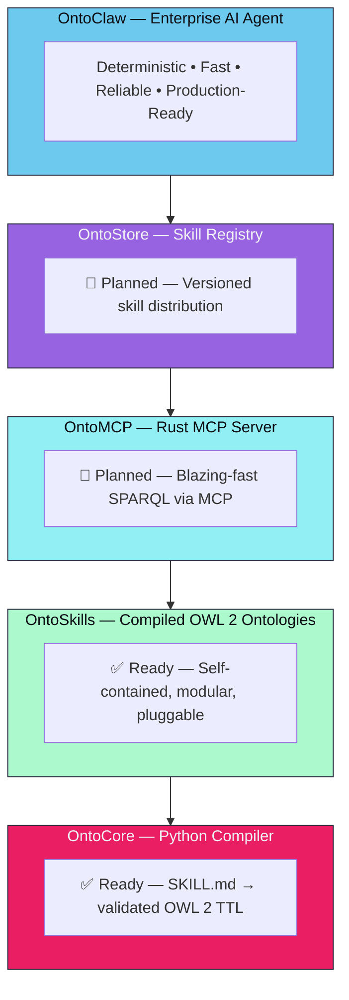
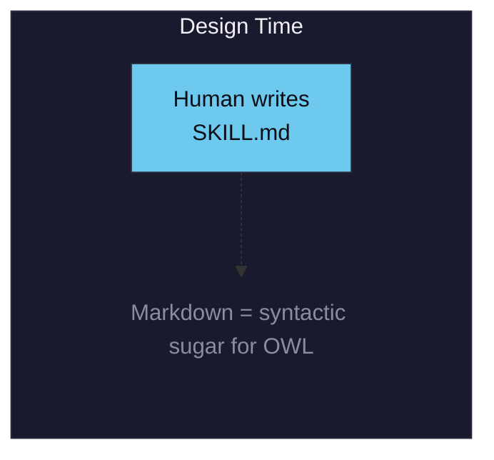
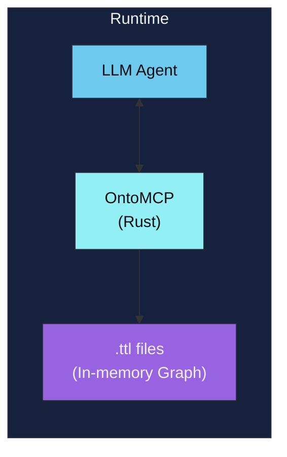
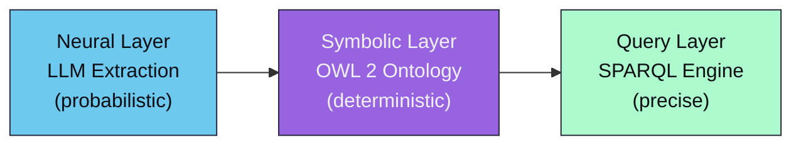
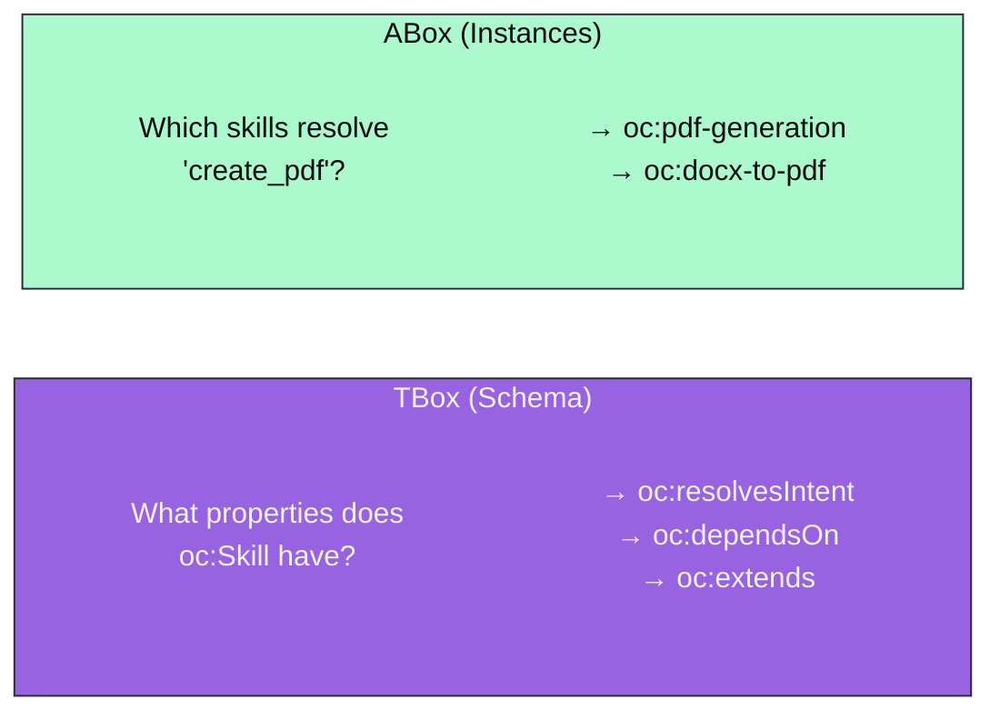

# OntoClaw Philosophy

## 0. The OntoClaw Ecosystem

OntoClaw is not just a compiler — it's a **complete neuro-symbolic platform** for building deterministic, enterprise-grade AI agents. The ecosystem consists of four layered components:



### The Vision

**OntoClaw** is inspired by OpenClaw, Claude Code, and Cursor — but built for **enterprise** with a focus on:

- **Determinism**: OWL 2 Description Logics guarantee decidable reasoning
- **Speed**: Rust-based runtime (OntoMCP) for blazing-fast SPARQL queries
- **Reliability**: SHACL validation ensures ontological consistency
- **Modularity**: Plug-and-play skill ontologies

The key insight: **Skills are compiled artifacts, not interpreted documents.**

---

## 1. The Lifecycle: Source Code vs Artifact

OntoCore implements a **compile-time paradigm** for skills, separating human authoring from machine execution:

### Design Time (Source Code)



Why Markdown? Because writing raw Turtle by hand is a terrible developer experience.

OntoCore extracts **everything** into the TTL:
- Intents (`oc:resolvesIntent`)
- State transitions (`oc:requiresState`, `oc:yieldsState`, `oc:handlesFailure`)
- **Execution payload** (`oc:hasPayload` with `oc:executor` + `oc:code`)
- Dependencies and relations (`oc:dependsOn`, `oc:extends`, `oc:contradicts`)

### Runtime (Artifact)



**SKILL.md files DO NOT EXIST in the agent's context.** The .ttl files are self-contained, modular, pluggable ontologies. All logic lives in RDF.

**The compiled TTL is the executable artifact. The Markdown is just source code that gets compiled away.**

This separation enables:
- **Human-friendly authoring** (Markdown during development)
- **Machine-optimal execution** (OWL 2 at runtime)
- **Modular deployment** (plug/unplug skill ontologies without touching source)

---

## 2. The Core Problem

Large Language Models are powerful but **non-deterministic**. The same prompt can yield different outputs across runs. When an agent must navigate dozens of skills, it faces:

- **Context rot**: Loading 50+ SKILL.md files consumes context window
- **Hallucination risk**: Information scattered across files is easily misremembered
- **No verifiable structure**: "Does skill A depend on skill B?" requires reading both files

This is the **knowledge retrieval problem** in the age of LLMs.

---

## 3. The Ontological Solution

OntoClaw applies **Description Logics (DL)** — specifically the **$\mathcal{SROIQ}^{(D)}$** fragment underlying OWL 2 DL — to transform unstructured skill definitions into **formal, queryable knowledge graphs**.

Key properties:

| DL Feature | OntoClaw Mapping |
|------------|------------------|
| **Concepts (𝒞)** | `oc:Skill`, `oc:ExecutableSkill`, `oc:DeclarativeSkill` |
| **Roles (ℛ)** | `oc:dependsOn`, `oc:extends`, `oc:contradicts` |
| **Individuals (𝒪)** | Each compiled skill instance |
| **Datatypes (𝒟)** | Literals: strings, integers, IRIs |

### The $\mathcal{SROIQ}^{(D)}$ Fragment

Each letter in $\mathcal{SROIQ}^{(D)}$ represents a specific expressive capability:

- **$\mathcal{S}$** — Basic logic ($\mathcal{ALC}$) extended with transitive properties. Essential for OntoClaw: if skill A extends B, and B extends C, the reasoner knows A extends C.

- **$\mathcal{R}$** — Complex role inclusions and disjoint properties. Allows expressing that `dependsOn` and `contradicts` are mutually exclusive.

- **$\mathcal{O}$** — Nominals. The ability to define a class by enumerating its specific individuals.

- **$\mathcal{I}$** — Inverse properties. Fundamental for OntoCore: if A dependsOn B, the graph database automatically deduces that B enables A without explicit declaration.

- **$\mathcal{Q}$** — Qualified cardinality restrictions. What our SHACL gatekeeper enforces: e.g., an ExecutableSkill must have exactly 1 hasPayload node.

- **$\mathcal{D}$** — Datatype support (strings, integers, booleans for our literals).

**Decidability**: OWL 2 DL is decidable — reasoning algorithms terminate in finite time with correct answers. This contrasts with the open-ended nature of LLM reasoning.

---

## 4. Neuro-Symbolic Architecture

OntoClaw is **neuro-symbolic**: it combines neural and symbolic AI paradigms.



- **Neural**: Claude extracts structured knowledge from natural language (OntoCore)
- **Symbolic**: OWL 2 ontology stores knowledge with formal semantics (OntoSkills)
- **Query**: SPARQL provides precise, indexed retrieval (OntoMCP)

The neural layer handles ambiguity and interpretation. The symbolic layer ensures consistency and verifiability.

---

## 5. Democratizing Intelligence

A key ambition: **enable smaller models to reason about large skill ecosystems**.

Consider an agent with 100 skills:
- **Without ontology**: Must read 100 SKILL.md files (~500KB of text) to understand capabilities
- **With ontology**: Queries `SELECT ?skill WHERE { ?skill oc:resolvesIntent ?intent }` in milliseconds

This is especially valuable for:
- **Edge deployment**: Smaller models on local hardware
- **Cost reduction**: Fewer tokens processed per query
- **Reliability**: Deterministic answers, no hallucination about skill relationships

### Schema Exposure

Before querying, an LLM needs to know: **"What can I ask?"**

OntoClaw exposes the **TBox** (terminological box) — the schema of classes and properties — separately from the **ABox** (assertional box) of individual skills.



This two-stage querying prevents "blind" questions and improves precision.

---

## 6. Performance Characteristics

| Operation | Text Files | OWL Ontology |
|-----------|------------|--------------|
| Find skill by intent | O(n) scan all files | O(1) indexed SPARQL |
| Check dependencies | Parse each file | Follow `oc:dependsOn` edges |
| Detect conflicts | Compare all pairs | `oc:contradicts` lookup |
| Transitive closure | Recursively scan | OWL reasoning (optional) |

For 100 skills with average 5KB each:
- **Text scan**: ~500KB to read
- **SPARQL query**: ~1KB index lookup

The gap widens with scale.

---

## 7. Schema-First Querying

Traditional skill systems require the LLM to "guess" what information exists. OntoClaw inverts this:

1. **First**: Query the TBox to understand available classes and properties
2. **Then**: Construct precise ABox queries with known predicates

Example TBox query:

```sparql
SELECT ?property ?range WHERE {
  ?property rdfs:domain oc:Skill .
  ?property rdfs:range ?range .
}
```

Returns: `oc:resolvesIntent → xsd:string`, `oc:dependsOn → oc:Skill`, etc.

This enables **informed querying** — the LLM knows the ontology's structure before asking questions.

---

## 8. Enterprise Focus

OntoClaw is designed for **production enterprise environments**:

### Determinism Over Flexibility

While other agents optimize for flexibility, OntoClaw optimizes for **predictable, reproducible behavior**:

- Same input → same skill selection (via SPARQL, not LLM judgment)
- Same dependencies → same execution order (via `oc:dependsOn` edges)
- Same states → same transitions (via `oc:requiresState` / `oc:yieldsState`)

### Security First

OntoCore implements **defense-in-depth**:
- Regex pattern matching for known attack vectors
- LLM review for ambiguous content
- SHACL validation prevents malformed ontologies
- No execution of unvalidated payloads

### Audit Trail

Every compiled skill carries:
- `oc:generatedBy` — which LLM model extracted it
- `oc:hash` — content hash for integrity verification
- `oc:provenance` — source file reference

---

## 9. Research Foundations

OntoClaw builds on decades of research in Knowledge Representation and Reasoning:

### Description Logics
- Baader, F., et al. (2003). *The Description Logic Handbook*. Cambridge University Press.
- Horrocks, I., et al. (2006). "OWL 1.1: The Next Steps". *ISWC*.

### OWL 2 Specification
- W3C OWL 2 Web Ontology Language (2009). [https://www.w3.org/TR/owl2-overview/](https://www.w3.org/TR/owl2-overview/)
- Motik, B., et al. (2009). "OWL 2: The Next Generation". *Journal of Web Semantics*.

### Knowledge Representation
- Brachman, R., Levesque, H. (2004). *Knowledge Representation and Reasoning*. Morgan Kaufmann.
- Sowa, J. (2000). *Knowledge Representation*. Brooks/Cole.

### Neuro-Symbolic AI
- d'Avila Garcez, A., Lamb, L. (2020). "Neurosymbolic AI: The 3rd Wave". *arXiv:2012.05876*.
- Raaijmakers, S. (2023). *AI Generation: Rendering the Future*. (Neuro-symbolic chapter)

### Semantic Web Technologies
- Heath, T., Bizer, C. (2011). "Linked Data: Evolving the Web into a Global Data Space". *Synthesis Lectures on the Semantic Web*.
- SPARQL 1.1 Query Language (2013). [https://www.w3.org/TR/sparql11-query/](https://www.w3.org/TR/sparql11-query/)

---

*OntoClaw is the bridge: neural flexibility for extraction, symbolic rigor for storage, precise queries for retrieval.*
