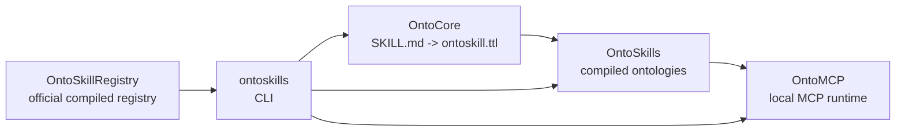

<p align="center">
  
</p>

<h1 align="center">
  <a href="https://ontoskills.marea.software" style="text-decoration: none; color: inherit; display: inline-flex; align-items: center; justify-content: center; gap: 10px;">
    
    <span>OntoSkills</span>
  </a>
</h1>

<p align="center">
  <strong>The deterministic skill platform for AI agents.</strong>
</p>

<p align="center">
  <span style="color:#00bf63;font-weight:bold">OntoCore</span> •
  <span style="color:#2196F3;font-weight:bold">OntoMCP</span> •
  <span style="color:#9333EA;font-weight:bold">OntoSkillRegistry</span> •
  <span style="color:#e91e63;font-weight:bold">ontoskills CLI</span>
</p>

<p align="center">
  <a href="#ecosystem">Ecosystem</a> •
  <a href="#use-cases">Use Cases</a> •
  <a href="#installation">Installation</a> •
  <a href="#cli-commands">CLI</a> •
  <a href="#registry-and-packages">Registry</a> •
  <a href="#local-mcp-server">MCP Server</a> •
  <a href="#documentation">Documentation</a>
</p>

---

## Ecosystem

OntoSkills is a neuro-symbolic platform that turns `SKILL.md` sources into queryable OWL 2 ontologies, ships a local MCP runtime, and distributes compiled skills through an official registry.



### What Ships

| Component | Purpose |
|-----------|---------|
| `ontoskills` | User-facing CLI for installs, updates, registry operations, source imports, and managed local state |
| `ontocore` | Compiler for turning `SKILL.md` sources into validated ontologies |
| `ontomcp` | Local MCP server for semantic skill discovery, context retrieval, and planning |
| `OntoSkillRegistry` | Official compiled skill registry, built in by default |

---

## Use Cases

| Use Case | How OntoSkills Helps |
|----------|----------------------|
| Enterprise AI agents | Deterministic skill discovery via ontology queries instead of file reading |
| Edge and small-model deployments | Query only the relevant skill context instead of loading large prompt bundles |
| Multi-agent systems | Shared ontology as capability graph, planning graph, and epistemic layer |
| Auditable automation | Provenance, skill metadata, and explicit enable/disable state |
| Skill distribution | Published compiled skills can be installed remotely from the official registry |

---

## Why OntoSkills

### The problem

Raw skill files are hard to distribute, expensive to load, and ambiguous to query. As the number of skills grows, agents either read too much context or make poor decisions from incomplete context.

### The approach

OntoSkills turns skills into OWL 2 knowledge artifacts and serves them through a narrow runtime interface:

- `OntoCore` compiles source skills
- `OntoSkillRegistry` distributes compiled skills
- `ontoskills` manages install/update/enable/disable flows
- `OntoMCP` exposes the enabled ontology set to MCP clients

### The result

- deterministic retrieval instead of fuzzy file scanning
- package-aware provenance and versioning
- smaller MCP tool surface
- installable skill ecosystems instead of repo-only artifacts

---

## Installation

### Runtime-only install

```bash
npx ontoskills install mcp
npx ontoskills search hello
npx ontoskills install marea.greeting/hello
npx ontoskills enable marea.greeting/hello
```

### Install the compiler too

```bash
npx ontoskills install core
ontoskills init-core
ontoskills compile
```

Everything is managed under:

```text
~/.ontoskills/
  bin/
  core/
  ontoskills/
  skills/
  state/
```

---

## CLI Commands

### Product commands

```bash
ontoskills install mcp
ontoskills install core
ontoskills update mcp
ontoskills update core
ontoskills search hello
ontoskills install marea.greeting/hello
ontoskills enable marea.greeting/hello
ontoskills disable marea.greeting/hello
ontoskills remove marea.greeting/hello
ontoskills rebuild-index
ontoskills uninstall --all
```

### Compiler-oriented commands

```bash
ontoskills init-core
ontoskills compile
ontoskills compile my-skill
ontoskills query "SELECT ?s WHERE { ?s a oc:Skill }"
```

### Source import

```bash
ontoskills import-source-repo https://github.com/nextlevelbuilder/ui-ux-pro-max-skill
```

This clones the source repo into `~/.ontoskills/skills/vendor/` and compiles the results into `~/.ontoskills/ontoskills/vendor/`.

---

## Registry And Packages

### Official registry

The official registry is built into the CLI and does not need manual setup.

Current demo package:

- `marea.greeting/hello`

Registry repository:

- [OntoSkillRegistry](https://github.com/mareasoftware/OntoSkillRegistry)

### Third-party registries

Third-party registries are opt-in:

```bash
ontoskills registry add-source acme https://example.com/index.json
ontoskills registry list
```

### Enable/disable model

- install puts a compiled skill in the local store
- enable exposes it to OntoMCP
- disable removes it from the enabled runtime index

---

## Local MCP Server

`OntoMCP` is the runtime that loads enabled ontologies and exposes them through MCP.

The current MCP tool surface is:

- `search_skills`
- `get_skill_context`
- `evaluate_execution_plan`
- `query_epistemic_rules`

For local development from the repository:

```bash
cargo run --manifest-path mcp/Cargo.toml -- --ontology-root ./ontoskills
```

For product install:

```bash
ontoskills install mcp
```

More in [mcp/README.md](mcp/README.md).

---

## Repository Layout

```text
core/        compiler
mcp/         MCP runtime
docs/        long-form documentation
registry/    official registry blueprint
site/        public site
skills/      source skills
ontoskills/  compiled ontology artifacts
specs/       SHACL and ontology constraints
```

---

## Documentation

- [Overview](docs/overview.md)
- [Getting Started](docs/getting-started.md)
- [Architecture](docs/architecture.md)
- [Knowledge Extraction](docs/knowledge-extraction.md)
- [Registry](docs/registry.md)
- [MCP Runtime](docs/mcp.md)
- [MCP With Claude Code](docs/mcp-claude-code.md)
- [MCP With Codex](docs/mcp-codex.md)
- [Roadmap](docs/roadmap.md)
- [MCP Guide](mcp/README.md)
- [Claude Code MCP Guide](mcp/CLAUDE_CODE_GUIDE.md)

---

## Related Links

- [Official Registry Repo](https://github.com/mareasoftware/OntoSkillRegistry)
- [Project Site](https://ontoskills.marea.software)
