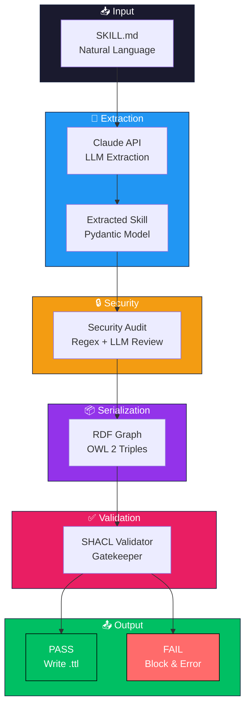
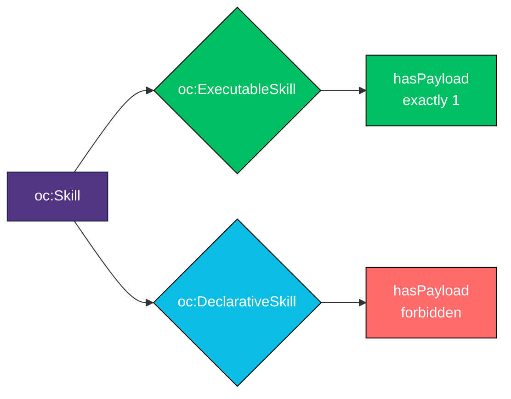
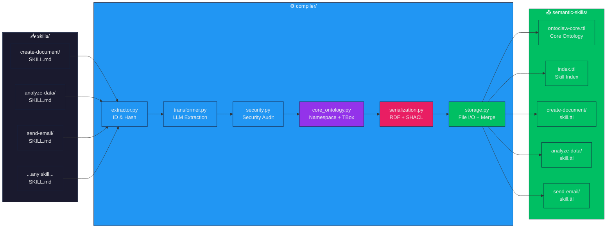
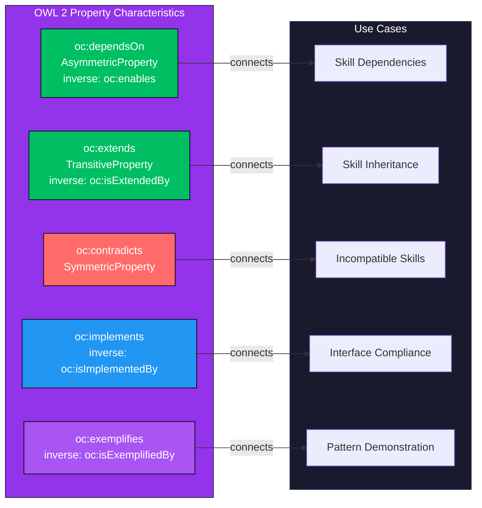
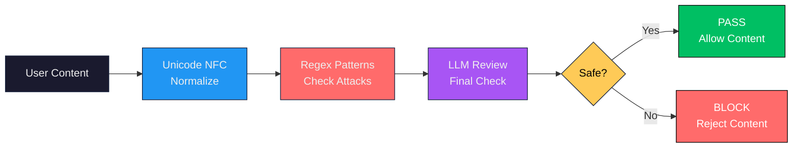

<p align="center">
  
</p>

<h1 align="center">
  <a href="https://ontoclaw.marea.software">
    
    OntoClaw
  </a>
</h1>

<p align="center">
  <strong>The first <span style="color:#e91e63">neuro-symbolic</span> skill compiler for the Agentic Web.</strong>
</p>

<p align="center">
  Transform natural language skill definitions into <span style="color:#00bf63;font-weight:bold">validated OWL 2 ontologies</span>.
</p>

<p align="center">
  <a href="#what-is-ontoclaw">What is it?</a> •
  <a href="#how-it-works">How it works</a> •
  <a href="#installation">Installation</a> •
  <a href="#cli-commands">CLI Commands</a> •
  <a href="PHILOSOPHY.md">Philosophy</a>
</p>

<p align="center">
  
  
  
  <a href="#license">
    
  </a>
</p>

<hr style="border:1px solid #ddd;"/>

---

## What is OntoClaw?

OntoClaw is a **skill compiler** that transforms natural language skill definitions into **validated semantic knowledge graphs**. It bridges the gap between human-readable documentation and machine-executable ontologies.

---

## Why OntoClaw?

### The Determinism Problem

LLMs are inherently **non-deterministic** — the same query can yield different results, and reasoning about skill relationships requires reading entire documents. This creates:
- **Context rot** from lengthy skill files
- **Hallucinations** when information is scattered
- **No verifiable structure** for skill relationships

OntoClaw transforms this into **deterministic, queryable knowledge graphs**.

### Description Logics Foundation

Built on **OWL 2** (𝒜𝒞ℛ𝒪ℐ𝒟 Description Logic), enabling:
- **Decidable reasoning** — transitive, symmetric, inverse properties
- **Formal semantics** — no ambiguity in skill relationships
- **SPARQL queries** with O(1) indexed lookup vs O(n) text scanning

### For Smaller Models

When an agent has 50+ skills, reading all SKILL.md files is impractical. With ontologies:
- Query only what's needed: `SELECT ?skill WHERE { ?skill oc:resolvesIntent "create_pdf" }`
- Schema exposure: know what nodes/relations exist before querying
- Smaller models can reason about complex skill ecosystems

[→ Read the full philosophy](PHILOSOPHY.md)

---

### Key Capabilities

| Capability | Description |
|------------|-------------|
| **LLM Extraction** | Uses Claude to extract structured knowledge from SKILL.md files |
| **Knowledge Architecture** | Follows the "A is a B that C" definition pattern (genus + differentia) |
| **OWL 2 Serialization** | Outputs valid OWL 2 ontologies in RDF/Turtle format |
| **SHACL Validation** | Constitutional gatekeeper ensures logical validity before write |
| **State Machines** | Skills can define preconditions, postconditions, and failure handlers |
| **Security Pipeline** | Defense-in-depth: regex patterns + LLM review for malicious content |

### What Gets Compiled

Every skill is extracted with:

- **Identity**: `nature`, `genus`, `differentia` (Knowledge Architecture)
- **Intents**: What user intentions this skill resolves
- **Requirements**: Dependencies (EnvVar, Tool, Hardware, API, Knowledge)
- **Execution Payload**: Optional code to execute (shell, python, node, claude_tool)
- **State Transitions**: `requiresState`, `yieldsState`, `handlesFailure`
- **Provenance**: `generatedBy` attestation (LLM model used)

---

## How It Works



### The Validation Gatekeeper

Every skill must pass SHACL validation before being written to disk. The constitutional shapes in `specs/ontoclaw.shacl.ttl` enforce:

| Constraint | Rule | Error Message |
|------------|------|---------------|
| `resolvesIntent` | Required (min 1) | "Ogni Skill deve avere almeno un resolvesIntent" |
| `generatedBy` | Required (exactly 1) | "Ogni Skill deve avere esattamente un generatedBy" |
| `requiresState` | Must be IRI of `oc:State` | "requiresState deve essere un URI che punta a un'istanza di oc:State" |
| `yieldsState` | Must be IRI of `oc:State` | "yieldsState deve essere un URI..." |
| `handlesFailure` | Must be IRI of `oc:State` | "handlesFailure deve essere un URI..." |

---

## Skill Types



The classification is **automatic** - you don't specify it. If a skill has code to execute, it's executable. If it's knowledge-only, it's declarative.

---

## Components

| Component | Language | Status | Description |
|-----------|----------|--------|-------------|
| [compiler/](compiler/) | Python | ✅ Ready | Skill compiler to OWL 2 ontology |
| [mcp/](mcp/) | Rust | 🚧 Planned | Fast MCP server for ontology queries |
| skills/ | Markdown | ✅ Ready | Input skill definitions |
| semantic-skills/ | Turtle | Generated | Compiled ontology output |
| specs/ | Turtle | ✅ Ready | SHACL shapes constitution |

---

## Installation

```bash
# Clone repository
git clone https://github.com/marea-software/ontoclaw.git
cd ontoclaw

# Install compiler
cd compiler
pip install -e ".[dev]"
```

### Dependencies

| Package | Purpose |
|---------|---------|
| `anthropic>=0.39.0` | Claude API for extraction |
| `click>=8.1.0` | CLI framework |
| `pydantic>=2.0.0` | Data validation |
| `rdflib>=7.0.0` | RDF graph handling |
| `pyshacl>=0.25.0` | SHACL validation |
| `rich>=13.0.0` | Terminal formatting |
| `owlrl>=1.0.0` | OWL reasoning |

---

## CLI Commands

```bash
# Initialize core ontology with predefined states
ontoclaw init-core

# Compile all skills to ontology
ontoclaw compile

# Compile specific skill
ontoclaw compile my-skill

# Query ontology with SPARQL
ontoclaw query "SELECT ?s WHERE { ?s a oc:Skill }"

# List all skills
ontoclaw list-skills

# Run security audit
ontoclaw security-audit
```

### Command Options

| Option | Description |
|--------|-------------|
| `-i, --input` | Input directory (default: `./skills/`) |
| `-o, --output` | Output file (default: `./semantic-skills/skills.ttl`) |
| `--dry-run` | Preview without saving |
| `--skip-security` | Skip security checks (not recommended) |
| `-f, --force` | Force recompilation (bypass hash-based cache) |
| `--reason/--no-reason` | Apply OWL reasoning |
| `-y, --yes` | Skip confirmation |
| `-v, --verbose` | Debug logging |
| `-q, --quiet` | Suppress progress |

---

## Exit Codes

| Code | Exception | Description |
|------|-----------|-------------|
| 0 | - | Success |
| 1 | `SkillETLError` | General ETL error |
| 3 | `SecurityError` | Security threat detected |
| 4 | `ExtractionError` | Skill extraction failed |
| 5 | `OntologyLoadError` | Ontology file not found or invalid |
| 6 | `SPARQLError` | Invalid SPARQL query |
| 7 | `SkillNotFoundError` | Skill not found in ontology |
| **8** | `OntologyValidationError` | **SHACL validation failed** |

---

## Project Structure

```
ontoclaw/
├── compiler/                 # Python skill compiler
│   ├── cli.py               # Click CLI interface
│   ├── config.py            # Configuration constants
│   ├── core_ontology.py     # Namespace and TBox ontology creation
│   ├── exceptions.py        # Exception hierarchy with exit codes
│   ├── extractor.py         # ID and hash generation
│   ├── schemas.py           # Pydantic models
│   ├── security.py          # Defense-in-depth security
│   ├── serialization.py     # RDF serialization with SHACL gatekeeper
│   ├── sparql.py            # SPARQL query engine
│   ├── storage.py           # File I/O, merging, orphan cleanup
│   ├── transformer.py       # LLM tool-use extraction
│   ├── validator.py         # SHACL validation gatekeeper
│   └── tests/               # Test suite (150 tests)
├── specs/
│   └── ontoclaw.shacl.ttl   # SHACL shapes constitution
├── skills/                  # Input: SKILL.md definitions
├── semantic-skills/         # Output: compiled .ttl files
│   ├── ontoclaw-core.ttl    # Core ontology with states
│   ├── index.ttl            # Index of all skills
│   └── */skill.ttl          # Individual skill modules
└── mcp/                     # (Planned) Rust MCP server
```

---

## Architecture



**Any skill directory works** - just add a `SKILL.md` file and OntoClaw will compile it to a validated OWL 2 ontology module.

---

## Testing

```bash
cd compiler
pytest tests/ -v
```

**Test Coverage**: 150 tests covering:
- Pydantic model validation
- Exception exit codes
- ID/hash generation
- Tool-use loop execution
- Security pattern matching + LLM review
- OWL properties, serialization, merge
- SPARQL query execution
- CLI commands and options
- **SHACL validation (5 comprehensive tests)**

---

## Knowledge Architecture

Skills are extracted following the **Knowledge Architecture** framework:

- **Categories of Being**: Tool, Concept, Work
- **Genus and Differentia**: "A is a B that C" definition structure
- **Relations as First-Class Citizens**:
  - `depends-on` - Skill prerequisites
  - `extends` - Skill inheritance
  - `contradicts` - Incompatible skills
  - `implements` - Interface compliance
  - `exemplifies` - Pattern demonstration

---

## OWL 2 Design



---

## Security Philosophy



Detected threats:
- Prompt injection (`ignore instructions`, `system:`, `you are now`)
- Command injection (`; rm`, `| bash`, command substitution)
- Data exfiltration (`curl -d`, `wget --data`)
- Path traversal (`../`, `/etc/passwd`)
- Credential exposure (`api_key=`, `password=`)

---

## <a id="license"></a>License

<p align="center">
  <a href="LICENSE">
    
  </a>
</p>

OntoClaw is open-source software, licensed under the **[MIT License](LICENSE)**.

| Permissions | Conditions | Limitations |
|-------------|------------|-------------|
| ✅ Commercial use | 📝 Include license and copyright notice | ⚖️ No Liability |
| ✅ Modification | | 🛡️ No Warranty |
| ✅ Distribution | | |
| ✅ Private use | | |

*© 2026 [Marea Software](https://marea.software)*
