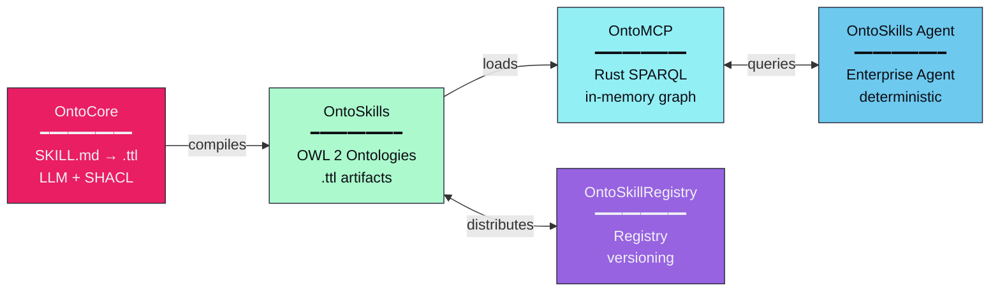
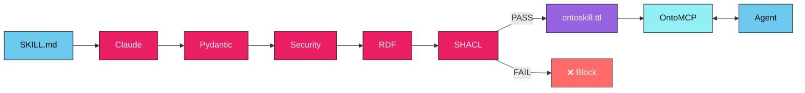
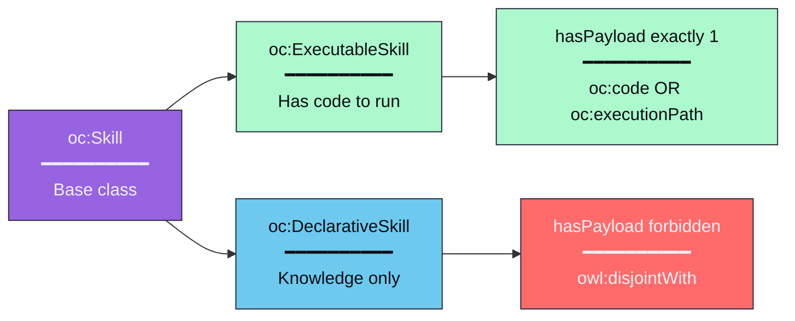
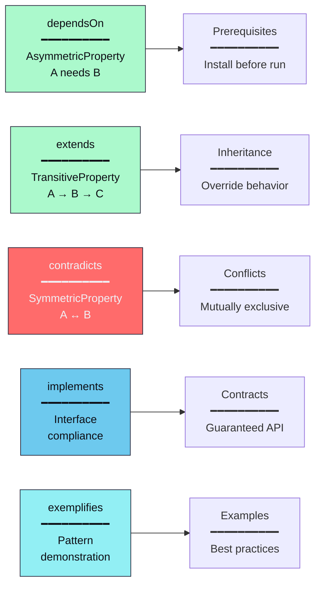
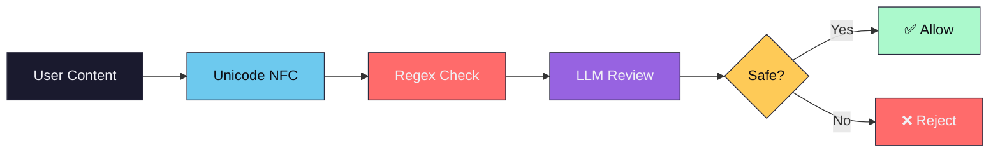

<p align="center">
  
</p>

<h1 align="center">
  <a href="https://ontoclaw.marea.software" style="text-decoration: none; color: inherit; display: flex; align-items: center; justify-content: center; gap: 10px;">
    
    <span>OntoSkills</span>
  </a>
</h1>

<p align="center">
  <strong>The <span style="color:#e91e63">deterministic</span> enterprise AI agent platform.</strong>
</p>

<p align="center">
  Neuro-symbolic architecture for the Agentic Web — <span style="color:#00bf63;font-weight:bold">OntoCore</span> • <span style="color:#2196F3;font-weight:bold">OntoMCP</span> • <span style="color:#9333EA;font-weight:bold">OntoSkillRegistry</span>
</p>

<p align="center">
  <a href="#the-ontoskills-ecosystem">Ecosystem</a> •
  <a href="#use-cases">Use Cases</a> •
  <a href="#installation">Installation</a> •
  <a href="#cli-commands">CLI</a> •
  <a href="#registry-and-packages">Registry</a> •
  <a href="#local-mcp-server">MCP Server</a> •
  <a href="PHILOSOPHY.md">Philosophy</a>
</p>

<p align="center">
  
  
  
  <a href="#license">
    
  </a>
</p>

---

## OntoSkills: Neuro-Symbolic AI Agent Platform

OntoSkills is a **complete neuro-symbolic platform** for building deterministic, enterprise-grade AI agents. It consists of four layered components:



---

## Use Cases

| Use Case | How OntoSkills Helps |
|----------|-------------------|
| **Enterprise AI Agents** | Deterministic skill selection via SPARQL queries instead of LLM judgment |
| **Edge Deployment** | Smaller models query large skill ecosystems without loading all files |
| **Multi-Agent Systems** | Shared OWL 2 ontology as coordination and knowledge layer |
| **Compliance & Audit** | Every skill carries `oc:generatedBy` attestation and content hash |
| **Skill Marketplaces** | OntoSkillRegistry enables versioned, plug-and-play skill distribution |

---

## OntoCore — The Compiler

**OntoCore** is the first component of the ecosystem. It's a **skill compiler** that transforms natural language skill definitions into **validated semantic knowledge graphs**.

- **OntoMCP** (the Rust MCP server) loads only compiled `.ttl` files into an in-memory graph
- Skills are **self-contained** — all logic, requirements, and execution payloads live in the ontology
- Ontologies are **modular and pluggable** — add/remove `.ttl` files to change agent capabilities

**The compiled TTL is the executable artifact. The Markdown is just source code that gets compiled away.**

---

## Why OntoSkills? — Deterministic AI Agents

### The Determinism Problem

LLMs are inherently **non-deterministic** — the same query can yield different results, and reasoning about skill relationships requires reading entire documents. This creates:
- **Context rot** from lengthy skill files
- **Hallucinations** when information is scattered
- **No verifiable structure** for skill relationships

OntoSkills transforms this into **deterministic, queryable knowledge graphs**.

### Description Logics Foundation

Built on **OWL 2** ($\mathcal{SROIQ}^{(D)}$ Description Logic), enabling:
- **Decidable reasoning** — transitive, symmetric, inverse properties
- **Formal semantics** — no ambiguity in skill relationships
- **SPARQL queries** with O(1) indexed lookup vs O(n) text scanning

### For Smaller Models

When an agent has 50+ skills, reading all SKILL.md files is impractical. With ontologies:
- Query only what's needed: `SELECT ?skill WHERE { ?skill oc:resolvesIntent "create_pdf" }`
- Schema exposure: know what nodes/relations exist before querying
- Smaller models can reason about complex skill ecosystems

[→ Read the full philosophy](PHILOSOPHY.md)

---

### Key Capabilities

| Capability | Description |
|------------|-------------|
| **LLM Extraction** | Uses Claude to extract structured knowledge from SKILL.md files |
| **Knowledge Architecture** | Follows the "A is a B that C" definition pattern (genus + differentia) |
| **OWL 2 Serialization** | Outputs valid OWL 2 ontologies in RDF/Turtle format |
| **SHACL Validation** | Constitutional gatekeeper ensures logical validity before write |
| **State Machines** | Skills can define preconditions, postconditions, and failure handlers |
| **Security Pipeline** | Defense-in-depth: regex patterns + LLM review for malicious content |

### What Gets Compiled

Every skill is extracted with:

- **Identity**: `nature`, `genus`, `differentia` (Knowledge Architecture)
- **Intents**: What user intentions this skill resolves
- **Requirements**: Dependencies (EnvVar, Tool, Hardware, API, Knowledge)
- **Execution Payload**: Optional code to execute (`oc:code` inline or `oc:executionPath` for external assets)
- **State Transitions**: `requiresState`, `yieldsState`, `handlesFailure`
- **Provenance**: `generatedBy` attestation (LLM model used)

---

## How It Works



### The Validation Gatekeeper

Every skill must pass SHACL validation before being written to disk. The constitutional shapes in `specs/ontoskills.shacl.ttl` enforce:

| Constraint | Rule | Error Message |
|------------|------|---------------|
| `resolvesIntent` | Required (min 1) | "Ogni Skill deve avere almeno un resolvesIntent" |
| `generatedBy` | Required (exactly 1) | "Ogni Skill deve avere esattamente un generatedBy" |
| `requiresState` | Must be IRI | "requiresState deve essere un URI" |
| `yieldsState` | Must be IRI | "yieldsState deve essere un URI" |
| `handlesFailure` | Must be IRI | "handlesFailure deve essere un URI" |

---

## Skill Types



The classification is **automatic** - you don't specify it. If a skill has code to execute, it's executable. If it's knowledge-only, it's declarative. These classes are **mutually exclusive** (`owl:disjointWith`) per OWL 2 DL semantics.

---

## Components

| Component | Language | Status | Phase | Description |
|-----------|----------|--------|-------|-------------|
| **OntoCore** (`core/`) | Python | ✅ Ready | Design Time | Skill compiler to OWL 2 ontology |
| **OntoMCP** (`mcp/`) | Rust | ✅ Ready | Runtime | MCP server for semantic skill discovery and planning |
| **OntoSkillRegistry** | GitHub | 🚧 In Progress | Distribution | Versioned compiled skill registry |
| **OntoSkills Agent** | Python/Rust | 📋 Roadmap | Agent | Enterprise AI agent |
| `skills/` | Markdown | ✅ Ready | Design Time | **Source code** — human-authored skill definitions |
| `ontoskills/` | Turtle | Generated | Runtime | **Artifact** — compiled, self-contained ontologies |
| `specs/` | Turtle | ✅ Ready | Both | SHACL shapes constitution |

---

## Installation

```bash
# Runtime-only install via npm/npx
npx ontoskills install mcp
npx ontoskills install marea.greeting/hello
npx ontoskills enable marea.greeting/hello
```

OntoSkills installs everything under:

```text
~/.ontoskills/
  bin/
  ontoskills/
  skills/
  state/
  core/
```

The official compiled registry is live at:

- `https://github.com/mareasoftware/OntoSkillRegistry`

The default `ontoskills` workflow already points there automatically. The first public demo package is:

- `marea.greeting/hello`

For compiler development from source:

```bash
git clone https://github.com/mareasoftware/ontoskills.git
cd ontoskills

# Install OntoCore
cd core
pip install -e ".[dev]"
```

### Compiler Configuration

The compiler reads environment variables directly and also auto-loads a repo-local `.env` file.

Typical settings:

```env
ANTHROPIC_API_KEY=your_api_key
ANTHROPIC_BASE_URL=https://your-provider-compatible-base-url
ANTHROPIC_MODEL=claude-opus-4-6
SECURITY_MODEL=claude-opus-4-6
```

This is useful when routing extraction through an Anthropic-compatible provider and avoids
re-exporting credentials before every compile run.

### Dependencies

| Package | Purpose |
|---------|---------|
| `anthropic>=0.39.0` | Claude API for extraction |
| `click>=8.1.0` | CLI framework |
| `pydantic>=2.0.0` | Data validation |
| `rdflib>=7.0.0` | RDF graph handling |
| `pyshacl>=0.25.0` | SHACL validation |
| `rich>=13.0.0` | Terminal formatting |
| `owlrl>=1.0.0` | OWL reasoning |

### MCP Dependencies

The local MCP server in [mcp/](mcp/) is a standalone Rust crate built with:

- `oxigraph` for Turtle loading and SPARQL querying
- `serde` / `serde_json` for MCP message handling
- `walkdir` for recursive ontology loading

---

## CLI Commands

```bash
# Initialize core ontology with predefined states
ontocore init-core

# Compile all skills to ontology
ontocore compile

# Compile specific skill
ontocore compile my-skill

# Compile a nested skill path
ontocore compile demo/markdown-inventory

# Query ontology with SPARQL
ontocore query "SELECT ?s WHERE { ?s a oc:Skill }"

# List all skills
ontocore list-skills

# Run security audit
ontocore security-audit

# Search and install a remote compiled skill from the built-in official registry
npx ontoskills search hello
npx ontoskills install marea.greeting/hello
npx ontoskills enable marea.greeting/hello
npx ontoskills list-installed
npx ontoskills rebuild-index

# Add an extra third-party registry only if needed
npx ontoskills registry add-source acme https://example.com/index.json
npx ontoskills registry list

# Managed component installs
npx ontoskills install mcp
npx ontoskills install core
npx ontoskills update mcp
npx ontoskills update core

# Import and compile a raw source repository
npx ontoskills import-source https://github.com/nextlevelbuilder/ui-ux-pro-max-skill

# Full uninstall
npx ontoskills uninstall --all
```

### Command Options

| Option | Description |
|--------|-------------|
| `-i, --input` | Input directory (default: `./skills/`) |
| `-o, --output` | Output file (default: `./ontoskills/skills.ttl`) |
| `--dry-run` | Preview without saving |
| `--skip-security` | Skip security checks (not recommended) |
| `-f, --force` | Force recompilation (bypass hash-based cache) |
| `-y, --yes` | Skip confirmation |
| `-v, --verbose` | Debug logging |
| `-q, --quiet` | Suppress progress |

---

## Registry And Packages

OntoSkills now supports a simplified registry and import model:

- the user-facing product root is `~/.ontoskills/`
- imported source repositories are cloned into `~/.ontoskills/skills/vendor/`
- compiled imported packages live in `~/.ontoskills/ontoskills/vendor/`
- runtime state lives in `~/.ontoskills/state/`

Important runtime files:

- `~/.ontoskills/state/registry.lock.json`
- `~/.ontoskills/state/registry.sources.json`
- `~/.ontoskills/state/release.lock.json`
- `~/.ontoskills/ontoskills/index.installed.ttl`
- `~/.ontoskills/ontoskills/index.enabled.ttl`

### Package Types

- **Registry packages** distribute compiled `.ttl` modules and are published from a static GitHub repo
- **Source repositories** are imported directly from a path or Git URL; `ontoskills` clones/copies them into `~/.ontoskills/skills/vendor/`, discovers `SKILL.md`, and compiles them into `~/.ontoskills/ontoskills/vendor/`

The official registry is built in by default. `registry add-source` is only needed for additional registries maintained by other users or organizations.

### End-User Registry Flow

For most users, the expected flow is:

```bash
npx ontoskills search hello
npx ontoskills install marea.greeting/hello
npx ontoskills enable marea.greeting/hello
```

No manual registry bootstrap is required for the official registry.

This flow has been verified end-to-end against the public `OntoSkillRegistry` repository.

### Identity Model

- Canonical identity: `package_id/skill_id`
- Short ids like `xlsx` remain valid as lookup conveniences
- Ambiguous short ids resolve with precedence:
  - `local > verified > trusted > community`

### Blueprint

The future official registry mono-repo is prototyped locally in:

- [registry/README.md](registry/README.md)
- [registry/index.json](registry/index.json)
- [specs/registry-package-spec.md](specs/registry-package-spec.md)

## Local MCP Server

OntoSkills now includes a **local Rust MCP server** under [mcp/](mcp/).

The MCP server is intentionally focused on:

- skill discovery from compiled ontologies
- semantic lookup by intent, dependency, and state transitions
- planning support from `requiresState` and `yieldsState`
- payload lookup for the calling agent

The server does **not** execute skill payloads. Payload execution is delegated to the calling agent in its own runtime context.

### Implemented MCP Tools

- `search_skills`
- `get_skill_context`
- `evaluate_execution_plan`
- `query_epistemic_rules`

### Run The MCP Server

From the repository root:

```bash
cargo run --manifest-path mcp/Cargo.toml
```

The server auto-discovers `ontoskills/` by looking in the current directory and its parents.

To force a specific ontology root:

```bash
cargo run --manifest-path mcp/Cargo.toml -- --ontology-root ./ontoskills
```

### Claude Code Guide

For full setup and verification steps with Claude Code, see [mcp/CLAUDE_CODE_GUIDE.md](mcp/CLAUDE_CODE_GUIDE.md).

### MCP Smoke Checks

```bash
cd mcp
cargo test
```

Current Rust test coverage includes:

- intent lookup
- knowledge-aware skill context
- enabled manifest loading
- qualified id resolution and precedence
- planner preference for direct skills over setup-heavy alternatives

---

## Exit Codes

| Code | Exception | Description |
|------|-----------|-------------|
| 0 | - | Success |
| 1 | `SkillETLError` | General ETL error |
| 3 | `SecurityError` | Security threat detected |
| 4 | `ExtractionError` | Skill extraction failed |
| 5 | `OntologyLoadError` | Ontology file not found or invalid |
| 6 | `SPARQLError` | Invalid SPARQL query |
| 7 | `SkillNotFoundError` | Skill not found in ontology |
| **8** | `OntologyValidationError` | **SHACL validation failed** |

---

## Project Structure

```
ontoskills/
├── core/                    # OntoCore — Python skill compiler
│   ├── cli.py               # Click CLI interface
│   ├── config.py            # Configuration constants
│   ├── core_ontology.py     # Namespace and TBox ontology creation
│   ├── exceptions.py        # Exception hierarchy with exit codes
│   ├── extractor.py         # ID and hash generation
│   ├── schemas.py           # Pydantic models
│   ├── security.py          # Defense-in-depth security
│   ├── serialization.py     # RDF serialization with SHACL gatekeeper
│   ├── sparql.py            # SPARQL query engine
│   ├── storage.py           # File I/O, merging, orphan cleanup
│   ├── transformer.py       # LLM tool-use extraction
│   ├── validator.py         # SHACL validation gatekeeper
│   └── tests/               # Test suite (156 tests)
├── mcp/                     # OntoMCP — Rust MCP server
│   ├── Cargo.toml           # Rust package manifest
│   ├── Cargo.lock           # Dependency lockfile
│   ├── README.md            # MCP server documentation
│   ├── CLAUDE_CODE_GUIDE.md # Claude Code integration guide
│   └── src/
│       ├── main.rs          # MCP stdio server
│       └── catalog.rs       # Ontology catalog + planner
├── specs/
│   └── ontoskills.shacl.ttl # SHACL shapes constitution
├── skills/                  # Input: SKILL.md definitions (source code)
├── ontoskills/              # Output: compiled .ttl files (artifacts)
│   ├── ontoskills-core.ttl  # Core ontology with states
│   ├── index.ttl            # Index of all skills
│   └── */ontoskill.ttl      # Individual skill modules
└── docs/                    # Documentation
```

---

## Architecture

```mermaid
flowchart LR
    IN["skills/SKILL.md<br/>━━━━━━━━━━<br/>Source input"] -->|"generate ID/hash"| E["extractor<br/>━━━━━━━━━━<br/>ID + SHA-256"]
    E -->|"skill_dir"| T["transformer<br/>━━━━━━━━━━<br/>LLM tool-use"]
    T -->|"ExtractedSkill"| SEC["security<br/>━━━━━━━━━━<br/>Regex + LLM"]
    SEC -->|"if safe"| SR["serialization<br/>━━━━━━━━━━<br/>Pydantic → RDF"]
    SR -->|"validate"| ST["storage<br/>━━━━━━━━━━<br/>Write + merge"]
    ST --> OUT["ontoskills/<br/>ontoskill.ttl"]

    style IN fill:#6dc9ee,stroke:#2a2a3e,color:#0d0d14
    style E fill:#e91e63,stroke:#2a2a3e,color:#f0f0f5
    style T fill:#e91e63,stroke:#2a2a3e,color:#f0f0f5
    style SEC fill:#e91e63,stroke:#2a2a3e,color:#f0f0f5
    style SR fill:#e91e63,stroke:#2a2a3e,color:#f0f0f5
    style ST fill:#abf9cc,stroke:#2a2a3e,color:#0d0d14
    style OUT fill:#9763e1,stroke:#2a2a3e,color:#f0f0f5
```



**Any skill directory works** - just add a `SKILL.md` file and OntoCore will compile it to a validated OWL 2 ontology module.

---

## Testing

### Python Tests (OntoCore)

```bash
cd core
pytest tests/ -v
```

### Rust Tests (OntoMCP)

```bash
cd mcp
cargo test
```

**Test Coverage**: 156 Python tests + Rust unit tests covering:
- Pydantic model validation
- Exception exit codes
- ID/hash generation
- Tool-use loop execution
- Security pattern matching + LLM review
- OWL properties, serialization, merge
- SPARQL query execution
- CLI commands and options
- **SHACL validation (5 comprehensive tests)**

---

## Knowledge Architecture

Skills are extracted following the **Knowledge Architecture** framework:

- **Categories of Being**: Tool, Concept, Work
- **Genus and Differentia**: "A is a B that C" definition structure
- **Relations as First-Class Citizens**:
  - `depends-on` - Skill prerequisites
  - `extends` - Skill inheritance
  - `contradicts` - Incompatible skills
  - `implements` - Interface compliance
  - `exemplifies` - Pattern demonstration

---

## OWL 2 Design



---

## Security Philosophy



Detected threats:
- Prompt injection (`ignore instructions`, `system:`, `you are now`)
- Command injection (`; rm`, `| bash`, command substitution)
- Data exfiltration (`curl -d`, `wget --data`)
- Path traversal (`../`, `/etc/passwd`)
- Credential exposure (`api_key=`, `password=`)

---

## <a id="license"></a>License

<p align="center">
  <a href="LICENSE">
    
  </a>
</p>

OntoSkills is open-source software, licensed under the **[MIT License](LICENSE)**.

| Permissions | Conditions | Limitations |
|-------------|------------|-------------|
| ✅ Commercial use | 📝 Include license and copyright notice | ⚖️ No Liability |
| ✅ Modification | | 🛡️ No Warranty |
| ✅ Distribution | | |
| ✅ Private use | | |

*© 2026 [Marea Software](https://marea.software)*
