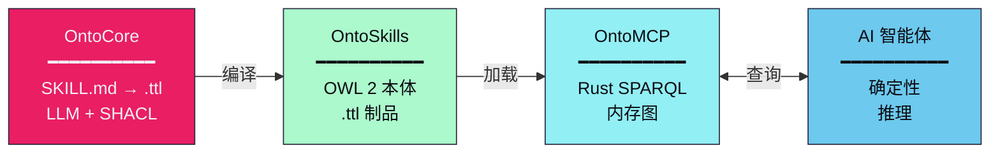

<p align="center">
  
</p>

<h1 align="center">
  <a href="https://ontoskills.sh" style="text-decoration: none; color: inherit; display: flex; align-items: center; justify-content: center; gap: 10px;">
    
    <span>OntoSkills</span>
  </a>
</h1>

<p align="center">
  <a href="README.md">🇬🇧 English</a> • <b>🇨🇳 中文</b>
</p>

<p align="center">
  <strong><span style="color:#e91e63">确定性</span>企业级 AI 智能体平台。</strong>
</p>

<p align="center">
  面向 Agentic Web 的神经符号架构 — <span style="color:#00bf63;font-weight:bold">OntoCore</span> • <span style="color:#2196F3;font-weight:bold">OntoMCP</span> • <span style="color:#9333EA;font-weight:bold">OntoStore</span>
</p>

<p align="center">
  <a href="docs_zh/overview.md">概述</a> •
  <a href="docs_zh/getting-started.md">快速开始</a> •
  <a href="docs_zh/roadmap.md">路线图</a> •
  <a href="PHILOSOPHY_zh.md">设计理念</a>
</p>

<p align="center">
  
  
  
  
  <a href="#license">
    
  </a>
</p>

---

## OntoSkills 是什么？

OntoSkills 将自然语言技能定义转换为**经过验证的 OWL 2 本体**——可查询的知识图谱，为 AI 智能体提供确定性推理能力。

**问题：** LLM 以概率方式读取技能。相同的查询，不同的结果。冗长的技能文件消耗大量 token 并使小模型困惑。

**解决方案：** 将技能编译成本体。用 SPARQL 查询。每次都能获得精确答案。



---

## 为什么选择 OntoSkills？

| 问题 | 解决方案 |
|---------|----------|
| LLM 每次对文本的解读都不同 | SPARQL 返回精确答案 |
| 50+ 个技能文件 = 上下文溢出 | 只查询所需内容 |
| 关系没有可验证的结构 | OWL 2 形式语义 |
| 小模型无法理解复杂技能 | 通过图查询实现智能民主化 |

**对于 100 个技能：** ~500KB 文本扫描 → ~1KB 查询

[→ 阅读完整设计理念](PHILOSOPHY_zh.md)

---

## 快速开始

```bash
# 安装
pip install ontocore

# 编译技能到本体
ontocore init-core
ontocore compile

# 查询知识图谱
ontocore query "SELECT ?skill WHERE { ?skill oc:resolvesIntent 'create_pdf' }"
```

或使用 `npx ontoskills` 无需安装。

[→ 完整安装指南](docs_zh/getting-started.md)

---

## 组件

| 组件 | 语言 | 状态 | 描述 |
|-----------|----------|--------|-------------|
| **OntoCore** | Python | ✅ 就绪 | 技能编译器，输出 OWL 2 本体 |
| **OntoMCP** | Rust | ✅ 就绪 | 用于语义技能发现的 MCP 服务器 |
| **OntoStore** | GitHub | ✅ 就绪 | 版本化技能商店 |
| `skills/` | Markdown | 输入 | 人工编写的技能定义 |
| `ontoskills/` | Turtle | 输出 | 编译后的自包含本体 |

---

## 文档

- **[概述](docs_zh/overview.md)** — OntoSkills 是什么及其重要性
- **[快速开始](docs_zh/getting-started.md)** — 安装和入门
- **[架构](docs_zh/architecture.md)** — 系统如何工作
- **[知识提取](docs_zh/knowledge-extraction.md)** — 从技能中提取价值
- **[商店与包](docs_zh/registry.md)** — 包分发和导入
- **[路线图](docs_zh/roadmap.md)** — 开发阶段

---

## <a id="license"></a>许可证

MIT 许可证 — 详情见 [LICENSE](LICENSE)。

*© 2026 [mareasw/ontoskills](https://github.com/mareasw/ontoskills)*
