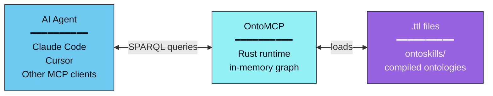
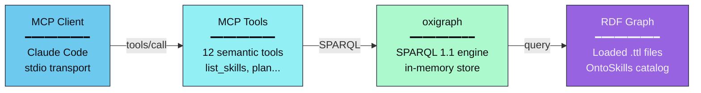
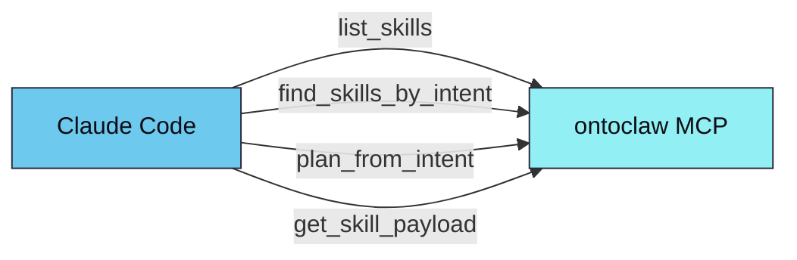

# OntoMCP

Rust-based local MCP (Model Context Protocol) server for the OntoClaw ecosystem.

**Status:** ✅ Ready

---

## Overview

OntoMCP is the **runtime layer** of OntoClaw. It loads compiled OntoSkills (`.ttl` files) into an in-memory RDF graph and provides blazing-fast SPARQL queries to AI agents via the Model Context Protocol.



**SKILL.md files DO NOT EXIST in the agent's context.** Only compiled `.ttl` artifacts are loaded.

---

## Scope

The MCP server is intentionally focused on:

- **Skill discovery** — Find skills by intent, state, or capability
- **Semantic lookup** — Query dependencies, conflicts, and transitions
- **Planning** — Generate execution plans from `requiresState`/`yieldsState`
- **Payload retrieval** — Return `oc:code` or `oc:executionPath` for execution

The server does **not** execute skill payloads. Payload execution is delegated to the calling agent in its current runtime context.

---

## Architecture



### Why Rust?

| Benefit | Description |
|---------|-------------|
| **Performance** | Sub-millisecond SPARQL queries for real-time agent interaction |
| **Memory efficiency** | Compact in-memory graph representation |
| **Safety** | Memory-safe by design, critical for production deployments |
| **Concurrency** | Parallel query execution without GIL limitations |

---

## Implemented Tools

| Tool | Purpose |
|------|---------|
| `list_skills` | List all available skills |
| `find_skills_by_intent` | Find skills matching a user intent |
| `get_skill` | Get full skill details by ID |
| `get_skill_requirements` | Get skill dependencies and prerequisites |
| `get_skill_transitions` | Get state transitions (requires/yields/handles) |
| `get_skill_dependencies` | Get skills this one depends on |
| `get_skill_conflicts` | Get skills that contradict this one |
| `find_skills_yielding_state` | Find skills that produce a given state |
| `find_skills_requiring_state` | Find skills that need a given state |
| `check_skill_applicability` | Check if skill can run with current states |
| `plan_from_intent` | Generate execution plan from intent |
| `get_skill_payload` | Get execution code/path for a skill |

---

## Ontology Source

The server loads compiled `.ttl` files from a directory:

- `ontoclaw-core.ttl` — Core TBox ontology with states
- `index.ttl` — Manifest with `owl:imports`
- `*/ontoskill.ttl` — Individual skill modules

**Auto-discovery**: Looks for `ontoskills/` from current directory upward.

**Override**:
```bash
--ontology-root /path/to/ontoskills
# or
ONTOCLAW_MCP_ONTOLOGY_ROOT=/path/to/ontoskills
```

---

## Run

From repository root:

```bash
cargo run --manifest-path mcp/Cargo.toml
```

With explicit ontology path:

```bash
cargo run --manifest-path mcp/Cargo.toml -- --ontology-root ./ontoskills
```

---

## Claude Code Integration

Register the MCP server:

```bash
claude mcp add ontoclaw -- \
  cargo run --manifest-path /absolute/path/to/ontoclaw/mcp/Cargo.toml
```

After registration, Claude Code can call:



For full setup steps, see [CLAUDE_CODE_GUIDE.md](CLAUDE_CODE_GUIDE.md).

---

## Testing

```bash
cd mcp
cargo test
```

**Rust test coverage**:
- Intent lookup
- Payload lookup
- Planning with preparatory skills
- Planner preference for direct skills over setup-heavy alternatives

---

## Related Components

| Component | Language | Description |
|-----------|----------|-------------|
| **OntoCore** | Python | Design-time compiler |
| **OntoMCP** | Rust | Runtime server (this) |
| **OntoStore** | TBD | Skill registry (planned) |
| **OntoClaw** | Python/Rust | Enterprise AI agent (planned) |

---

*Part of the [OntoClaw ecosystem](../README.md).*
