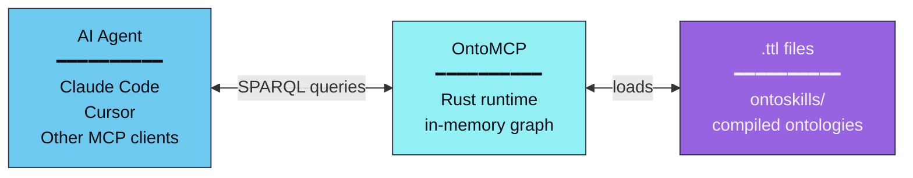
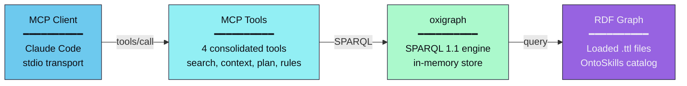
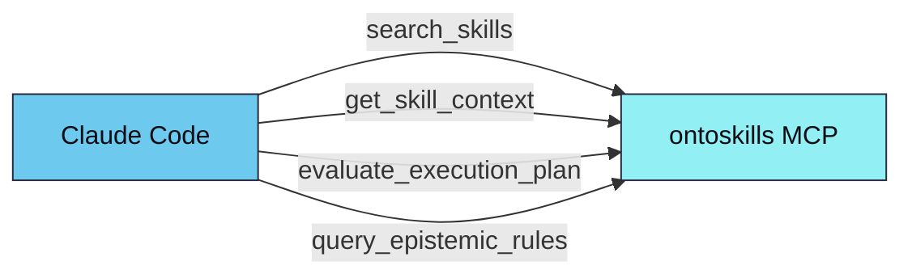

# OntoMCP

Rust-based local MCP (Model Context Protocol) server for the OntoSkills ecosystem.

**Status:** ✅ Ready

---

## Overview

OntoMCP is the **runtime layer** of OntoSkills. It loads compiled ontologies (`.ttl` files) into an in-memory RDF graph and provides blazing-fast SPARQL queries to AI agents via the Model Context Protocol.



**SKILL.md files DO NOT EXIST in the agent's context.** Only compiled `.ttl` artifacts are loaded.

---

## Scope

The MCP server is intentionally focused on:

- **Skill discovery** — Search skills by intent, state, and type
- **Skill context retrieval** — Return execution payload, transitions, dependencies, and knowledge nodes in one call
- **Planning** — Evaluate whether a skill or intent is executable from the current state set
- **Epistemic retrieval** — Query normalized `KnowledgeNode` rules by kind, dimension, severity, and context

The server does **not** execute skill payloads. Payload execution is delegated to the calling agent in its current runtime context.

---

## Architecture



### Why Rust?

| Benefit | Description |
|---------|-------------|
| **Performance** | Sub-millisecond SPARQL queries for real-time agent interaction |
| **Memory efficiency** | Compact in-memory graph representation |
| **Safety** | Memory-safe by design, critical for production deployments |
| **Concurrency** | Parallel query execution without GIL limitations |

---

## Implemented Tools

| Tool | Purpose |
|------|---------|
| `search_skills` | Discover skills with optional filters for intent, required state, yielded state, and type |
| `search_intents` | **(Optional)** Semantic search for intents via embeddings — returns matching intents with similarity scores |
| `get_skill_context` | Return the complete execution context for a skill, including payload and knowledge nodes |
| `evaluate_execution_plan` | Evaluate applicability and generate a plan for a target intent or skill |
| `query_epistemic_rules` | Query normalized knowledge nodes across the ontology with guided filters |

---

## Semantic Intent Discovery

When embeddings are exported via `ontoskills export-embeddings`, the MCP server provides:

### MCP Tool: `search_intents`

```json
{
  "name": "search_intents",
  "arguments": {
    "query": "create a pdf document",
    "top_k": 5
  }
}
```

Returns matching intents with similarity scores:
```json
{
  "query": "create a pdf document",
  "matches": [
    {"intent": "create_pdf", "score": 0.92, "skills": ["pdf"]},
    {"intent": "export_document", "score": 0.78, "skills": ["pdf", "document-export"]}
  ]
}
```

### MCP Resource: `ontology://schema`

A compact (~2KB) JSON schema describing available classes, properties, and example queries.

```
1. Agent reads ontology://schema → Knows all properties and conventions
2. User: "I need to create a PDF"
3. Agent calls: search_intents("create a pdf", top_k: 3)
4. Agent queries: SELECT ?skill WHERE { ?skill oc:resolvesIntent "create_pdf" }
5. Agent calls: get_skill_context("pdf")
```

### Performance Targets

| Metric | Target |
|--------|--------|
| Schema resource size | < 4KB |
| search_intents latency | < 50ms |
| ONNX model size | < 50MB |
| Memory footprint | < 100MB |

`skill_id` fields accept:
- short ids like `xlsx`
- qualified ids like `marea.office/xlsx`

When a short id is ambiguous, runtime resolution follows:
- `local > verified > trusted > community`

Responses include package metadata such as:
- `qualified_id`
- `package_id`
- `trust_tier`
- `version`
- `source`

---

## Ontology Source

The server loads compiled `.ttl` files from a directory.

Preferred runtime source:

- `~/.ontoskills/ontoskills/index.enabled.ttl` — enabled-only manifest generated by the product CLI

Fallbacks:

- `ontoskills-core.ttl` — Core TBox ontology with states
- `index.ttl` — Manifest with `owl:imports`
- `*/ontoskill.ttl` — Individual skill modules

**Auto-discovery**: Looks for `ontoskills/` from current directory upward.

If nothing is found locally, OntoMCP falls back to:

- `~/.ontoskills/ontoskills`

**Override**:
```bash
--ontology-root /path/to/ontoskills
# or
ONTOSKILLS_MCP_ONTOLOGY_ROOT=/path/to/ontoskills
```

---

## Run

From repository root:

```bash
cargo run --manifest-path mcp/Cargo.toml
```

With explicit ontology path:

```bash
cargo run --manifest-path mcp/Cargo.toml -- --ontology-root ./ontoskills
```

---

## Claude Code Integration

Register the MCP server:

```bash
claude mcp add ontoskills -- \
  ~/.ontoskills/bin/ontomcp
```

After registration, Claude Code can call:



For full setup steps, see [CLAUDE_CODE_GUIDE.md](CLAUDE_CODE_GUIDE.md).

---

## Testing

```bash
cd mcp
cargo test
```

**Rust test coverage**:
- Skill search
- Skill context retrieval with knowledge nodes
- Guided epistemic rule filtering
- Planner preference for direct skills over setup-heavy alternatives

---

## Related Components

| Component | Language | Description |
|-----------|----------|-------------|
| **OntoCore** | Python | Design-time compiler |
| **OntoMCP** | Rust | Runtime server (this) |
| **ontoskills-registry** | GitHub | Compiled skill registry |

---

*Part of the [OntoSkills ecosystem](../README.md).*
