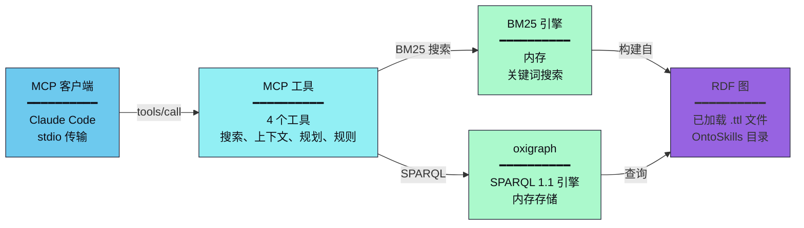
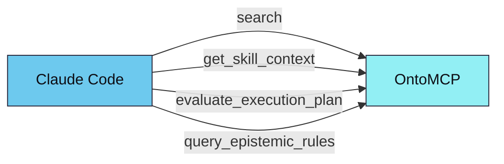

# OntoMCP

OntoSkills 生态系统中基于 Rust 的本地 MCP（模型上下文协议）服务器。

<p align="right">
  <a href="README.md">🇬🇧 English</a> • <b>🇨🇳 中文</b>
</p>

---

## 概述

OntoMCP 是 OntoSkills 的**运行时层**。它将编译后的本体（`.ttl` 文件）加载到内存 RDF 图中，通过模型上下文协议为 AI 智能体提供极速 SPARQL 查询。


**SKILL.md 文件在智能体的上下文中不存在。** 只加载编译后的 `.ttl` 制品。

---

## 范围

MCP 服务器专注于以下功能：

- **技能发现** — 按意图、状态和类型搜索技能
- **技能上下文检索** — 一次调用返回执行负载、状态转换、依赖以及所有知识节点（认知 + 操作）
- **规划** — 评估技能或意图在当前状态集下是否可执行
- **认知检索** — 按类型、维度、严重性和上下文查询规范化的 `KnowledgeNode` 规则

服务器**不**执行技能负载。负载执行委托给调用智能体在其当前运行时环境中完成。

---

## 架构



### 为什么用 Rust？

| 优势 | 描述 |
|------|------|
| **性能** | 亚毫秒级 SPARQL 查询，适合实时智能体交互 |
| **内存效率** | 紧凑的内存图表示 |
| **安全性** | 内存安全设计，适合生产部署 |
| **并发** | 无 GIL 限制的并行查询执行 |

---

## 已实现的工具

| 工具 | 用途 |
|------|------|
| `search` | 通过关键词查询、别名或结构化过滤器搜索技能。按参数分派：`query` → BM25 关键词搜索（可选语义回退），`alias` → 别名解析，否则 → 结构化技能搜索 |
| `get_skill_context` | 返回技能的完整执行上下文，包括负载和所有知识节点（认知 + 操作） |
| `evaluate_execution_plan` | 评估适用性并为目标意图或技能生成执行计划 |
| `query_epistemic_rules` | 通过引导过滤器查询本体中的规范化知识节点 |

---

## 意图发现

OntoMCP 提供两种搜索引擎用于技能发现：

### 默认：BM25 关键词搜索

当嵌入不可用时，使用 BM25 关键词搜索。启动时从技能意图、别名和描述构建内存 BM25 索引。

```json
{
  "name": "search",
  "arguments": {
    "query": "创建 PDF 文档",
    "top_k": 5
  }
}
```

返回匹配的技能及 BM25 分数：
```json
{
  "mode": "bm25",
  "query": "创建 PDF 文档",
  "results": [
    {
      "skill_id": "pdf",
      "qualified_id": "marea/office/pdf",
      "score": 0.87,
      "matched_by": "keyword",
      "intents": ["create pdf document", "export to pdf"],
      "aliases": ["pdf-generator"],
      "trust_tier": "official"
    }
  ]
}
```

### 语义搜索（ONNX 嵌入）— 可用时优先使用

使用 `--features embeddings` 编译且嵌入文件存在时，语义搜索优先于 BM25 — 对于大量技能目录中的细微查询，语义搜索提供更准确的结果。

```bash
# 构建时启用嵌入支持
cargo build --features embeddings
```

响应包含 `"mode": "semantic"` 及意图级别的匹配结果。如果嵌入失败或无结果，则回退到 BM25。

### MCP 资源：`ontology://schema`

一个紧凑的（约 2KB）JSON 模式，描述可用的类、属性和示例查询。

```
1. 智能体读取 ontology://schema → 了解所有属性和约定
2. 用户："我需要创建一个 PDF"
3. 智能体调用：search(query: "创建 PDF", top_k: 3)
4. 智能体查询：SELECT ?skill WHERE { ?skill oc:resolvesIntent "create_pdf" }
5. 智能体调用：get_skill_context("pdf")
```

### 性能目标

| 指标 | 目标 |
|------|------|
| 模式资源大小 | < 4KB |
| search 延迟（BM25） | < 5ms |
| search 延迟（语义，可选） | < 50ms |
| 内存占用（无嵌入） | < 50MB |

`skill_id` 字段接受：
- 短 ID，如 `xlsx`
- 完全限定 ID，如 `marea/office/xlsx`

当短 ID 有歧义时，运行时解析顺序：
- `official > local > verified > community`

响应包含包元数据，如：
- `qualified_id`
- `package_id`
- `trust_tier`
- `version`
- `source`

---

## 本体来源

服务器从目录加载编译后的 `.ttl` 文件。

首选运行时来源：

- `~/.ontoskills/ontologies/system/index.enabled.ttl` — 产品 CLI 生成的仅启用清单

后备来源：

- `core.ttl` — 核心TBox 本体（含状态定义）
- `index.ttl` — 包含 `owl:imports` 的清单
- `*/ontoskill.ttl` — 单独的技能模块

**自动发现**：从当前目录向上查找 `ontoskills/`。

如果本地未找到，OntoMCP 回退到：

- `~/.ontoskills/ontologies`

**覆盖**：
```bash
--ontology-root /path/to/ontology-root
# 或
ONTOMCP_ONTOLOGY_ROOT=/path/to/ontology-root
# 备选环境变量（效果相同）
ONTOSKILLS_MCP_ONTOLOGY_ROOT=/path/to/ontology-root
```

**ONNX Runtime**（可选，用于大规模技能目录）：
```bash
ORT_DYLIB_PATH=/path/to/directory-containing-libonnxruntime
```

---

## 运行

从仓库根目录：

```bash
cargo run --manifest-path mcp/Cargo.toml
```

指定本体路径：

```bash
cargo run --manifest-path mcp/Cargo.toml -- --ontology-root ./ontoskills
```

---

## 一键引导

使用产品 CLI：

```bash
npx ontoskills install mcp --claude
npx ontoskills install mcp --codex --cursor
npx ontoskills install mcp --cursor --project
```

CLI 先安装 `ontomcp`，然后在全局或当前项目中配置所选客户端。

## Claude Code 集成

注册 MCP 服务器：

```bash
claude mcp add ontomcp -- \
  ~/.ontoskills/bin/ontomcp
```

注册后，Claude Code 可以调用：



完整设置步骤请参阅 [Claude Code MCP 指南](https://ontoskills.sh/zh/docs/claude-code-mcp/)。

---

## 测试

```bash
cd mcp
cargo test
```

**Rust 测试覆盖**：
- 技能搜索
- 含知识节点的技能上下文检索
- 引导式认知规则过滤
- 规划器优先选择直接技能而非设置密集型替代方案

---

## 相关组件

| 组件 | 语言 | 描述 |
|------|------|------|
| **OntoCore** | Python | 神经符号技能编译器 |
| **OntoMCP** | Rust | 运行时服务器（本组件） |
| **OntoStore** | GitHub | 版本化技能注册表 |
| **CLI** | Node.js | 一键安装器（`npx ontoskills`） |

---

*OntoSkills 生态系统的一部分 — [GitHub](https://github.com/mareasw/ontoskills)*
