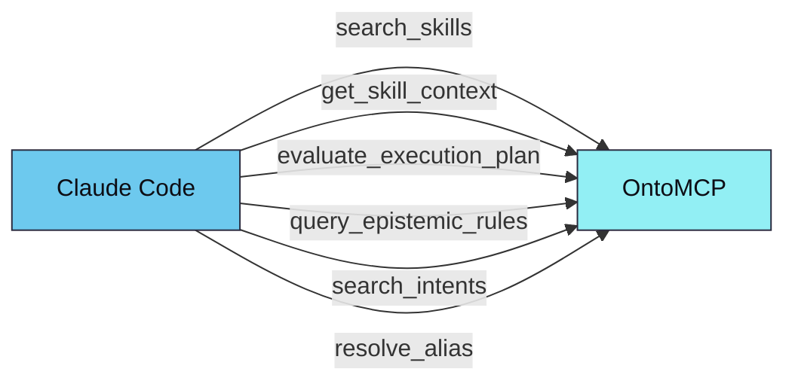

# OntoMCP

OntoSkills 生态系统中基于 Rust 的本地 MCP（模型上下文协议）服务器。

<p align="right">
  <a href="README.md">🇬🇧 English</a> • <b>🇨🇳 中文</b>
</p>

---

## 概述

OntoMCP 是 OntoSkills 的**运行时层**。它将编译后的本体（`.ttl` 文件）加载到内存 RDF 图中，通过模型上下文协议为 AI 智能体提供极速 SPARQL 查询。


**SKILL.md 文件在智能体的上下文中不存在。** 只加载编译后的 `.ttl` 制品。

---

## 范围

MCP 服务器专注于以下功能：

- **技能发现** — 按意图、状态和类型搜索技能
- **技能上下文检索** — 一次调用返回执行负载、状态转换、依赖和知识节点
- **规划** — 评估技能或意图在当前状态集下是否可执行
- **认知检索** — 按类型、维度、严重性和上下文查询规范化的 `KnowledgeNode` 规则

服务器**不**执行技能负载。负载执行委托给调用智能体在其当前运行时环境中完成。

---

## 架构


### 为什么用 Rust？

| 优势 | 描述 |
|------|------|
| **性能** | 亚毫秒级 SPARQL 查询，适合实时智能体交互 |
| **内存效率** | 紧凑的内存图表示 |
| **安全性** | 内存安全设计，适合生产部署 |
| **并发** | 无 GIL 限制的并行查询执行 |

---

## 已实现的工具

| 工具 | 用途 |
|------|------|
| `search_skills` | 发现技能，支持按意图、所需状态、产出状态、类型、category 和 is_user_invocable 过滤 |
| `search_intents` | **（可选）** 通过嵌入进行语义意图搜索 — 返回匹配的意图及相似度分数 |
| `get_skill_context` | 返回技能的完整执行上下文，包括负载和知识节点 |
| `evaluate_execution_plan` | 评估适用性并为目标意图或技能生成执行计划 |
| `query_epistemic_rules` | 通过引导过滤器查询本体中的规范化知识节点 |
| `resolve_alias` | 将技能别名解析为规范技能 ID |

---

## 语义意图发现

当通过 `ontocore export-embeddings` 导出嵌入时，MCP 服务器提供：

### MCP 工具：`search_intents`

```json
{
  "name": "search_intents",
  "arguments": {
    "query": "创建 PDF 文档",
    "top_k": 5
  }
}
```

返回匹配的意图及相似度分数：
```json
{
  "query": "创建 PDF 文档",
  "matches": [
    {"intent": "create_pdf", "score": 0.92, "skills": ["pdf"]},
    {"intent": "export_document", "score": 0.78, "skills": ["pdf", "document-export"]}
  ]
}
```

### MCP 资源：`ontology://schema`

一个紧凑的（约 2KB）JSON 模式，描述可用的类、属性和示例查询。

```
1. 智能体读取 ontology://schema → 了解所有属性和约定
2. 用户："我需要创建一个 PDF"
3. 智能体调用：search_intents("创建 PDF", top_k: 3)
4. 智能体查询：SELECT ?skill WHERE { ?skill oc:resolvesIntent "create_pdf" }
5. 智能体调用：get_skill_context("pdf")
```

### 性能目标

| 指标 | 目标 |
|------|------|
| 模式资源大小 | < 4KB |
| search_intents 延迟 | < 50ms |
| ONNX 模型大小 | < 50MB |
| 内存占用 | < 100MB |

`skill_id` 字段接受：
- 短 ID，如 `xlsx`
- 完全限定 ID，如 `marea/office/xlsx`

当短 ID 有歧义时，运行时解析顺序：
- `local > verified > trusted > community`

响应包含包元数据，如：
- `qualified_id`
- `package_id`
- `trust_tier`
- `version`
- `source`

---

## 本体来源

服务器从目录加载编译后的 `.ttl` 文件。

首选运行时来源：

- `~/.ontoskills/ontologies/system/index.enabled.ttl` — 产品 CLI 生成的仅启用清单

后备来源：

- `core.ttl` — 核心TBox 本体（含状态定义）
- `index.ttl` — 包含 `owl:imports` 的清单
- `*/ontoskill.ttl` — 单独的技能模块

**自动发现**：从当前目录向上查找 `ontoskills/`。

如果本地未找到，OntoMCP 回退到：

- `~/.ontoskills/ontologies`

**覆盖**：
```bash
--ontology-root /path/to/ontology-root
# 或
ONTOMCP_ONTOLOGY_ROOT=/path/to/ontology-root
```

**ONNX Runtime**（用于语义意图搜索）：
```bash
ORT_DYLIB_PATH=/path/to/onnxruntime/lib
```

---

## 运行

从仓库根目录：

```bash
cargo run --manifest-path mcp/Cargo.toml
```

指定本体路径：

```bash
cargo run --manifest-path mcp/Cargo.toml -- --ontology-root ./ontoskills
```

---

## 一键引导

使用产品 CLI：

```bash
npx ontoskills install mcp --claude
npx ontoskills install mcp --codex --cursor
npx ontoskills install mcp --cursor --project
```

CLI 先安装 `ontomcp`，然后在全局或当前项目中配置所选客户端。

## Claude Code 集成

注册 MCP 服务器：

```bash
claude mcp add ontomcp -- \
  ~/.ontoskills/bin/ontomcp
```

注册后，Claude Code 可以调用：



完整设置步骤请参阅 [Claude Code MCP 指南](https://ontoskills.sh/zh/docs/claude-code-mcp/)。

---

## 测试

```bash
cd mcp
cargo test
```

**Rust 测试覆盖**：
- 技能搜索
- 含知识节点的技能上下文检索
- 引导式认知规则过滤
- 规划器优先选择直接技能而非设置密集型替代方案

---

## 相关组件

| 组件 | 语言 | 描述 |
|------|------|------|
| **OntoCore** | Python | 神经符号技能编译器 |
| **OntoMCP** | Rust | 运行时服务器（本组件） |
| **OntoStore** | GitHub | 版本化技能注册表 |
| **CLI** | Node.js | 一键安装器（`npx ontoskills`） |

---

*OntoSkills 生态系统的一部分 — [GitHub](https://github.com/mareasw/ontoskills)*
