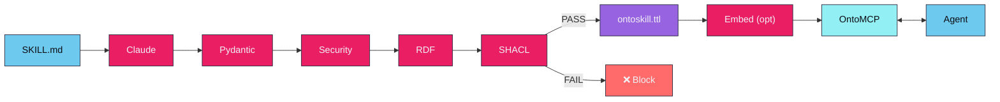
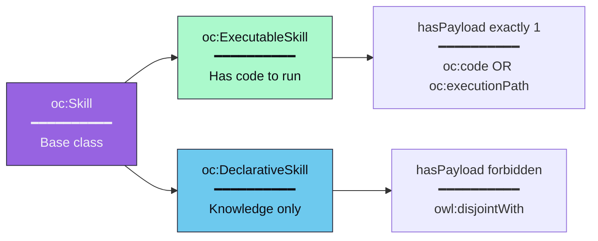
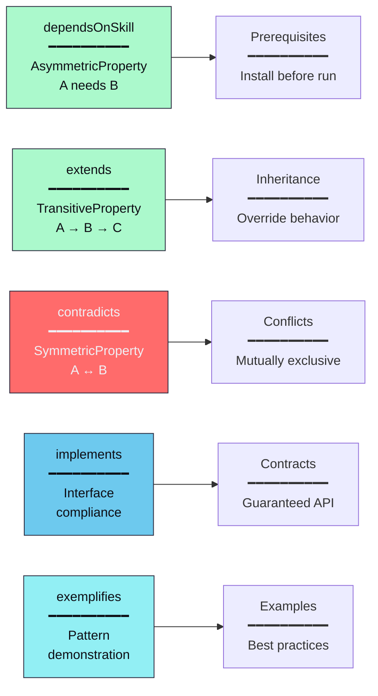
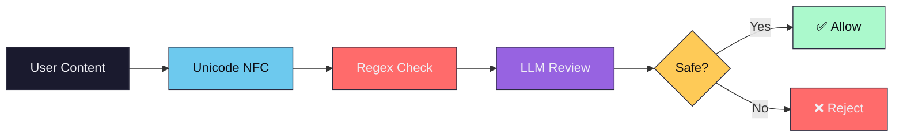

## The compilation pipeline



### Stage details

| Stage | Input | Output | Description |
|-------|-------|--------|-------------|
| **Extract** | SKILL.md | ExtractedSkill | LLM extracts structured knowledge |
| **Security** | ExtractedSkill | ExtractedSkill | Regex + LLM review for threats |
| **Serialize** | ExtractedSkill | RDF Graph | Pydantic → RDF triples |
| **Validate** | RDF Graph | ValidationResult | SHACL shapes check validity |
| **Write** | RDF Graph | .ttl file | Atomic write with backup |
| **Embed** | .ttl file | Embeddings | Per-skill vector embeddings (optional, requires ontocore[embeddings]) |

---

## Content model

OntoCore transforms markdown into a three-layer content model that OntoMCP queries via SPARQL.

```
FlatBlock → Section tree → ContentExtraction
```

**FlatBlock** — Every markdown element becomes a typed block (paragraph, code_block, table, etc.) with line range and content-specific properties. This is the raw, flat extraction from the parser.

**Section tree** — Blocks are organized into a hierarchy based on heading levels. Each section has a title, level, order, and contains content blocks and subsections. The tree structure uses:

| Property | Purpose |
|----------|---------|
| `oc:hasSection` | Links a skill to its top-level sections |
| `oc:hasSubsection` | Links a section to its child sections |
| `oc:hasContent` | Links a section to its content blocks |
| `oc:hasChild` | Links a list item or step to nested child blocks |
| `oc:sectionTitle` | Section heading text |
| `oc:sectionLevel` | Heading level (1-6) |
| `oc:contentOrder` | Ordering within a section |

**ContentExtraction** — The aggregated result containing all sections, code blocks, tables, flowcharts, procedures, and templates. This is what the LLM annotates during extraction.

In the TTL output, sections and content blocks are represented as blank nodes with `rdf:type` assertions (e.g., `oc:Paragraph`, `oc:CodeBlock`). The `get_skill_content` MCP tool queries these triples and reconstructs readable markdown from them — so agents can follow a skill's instructions step-by-step via SPARQL without reading the raw markdown.

---

## Skill types



The classification is **automatic** — you don't specify it. If a skill has code to execute, it's executable. If it's knowledge-only, it's declarative. These classes are **mutually exclusive** (`owl:disjointWith`).

---

## OWL 2 Properties



| Property | Type | Semantics |
|----------|------|-----------|
| `dependsOnSkill` | Asymmetric | A needs B, but B doesn't need A |
| `extends` | Transitive | If A extends B and B extends C, then A extends C |
| `contradicts` | Symmetric | If A contradicts B, then B contradicts A |
| `implements` | Irreflexive | A cannot implement itself |
| `exemplifies` | Irreflexive | A cannot exemplify itself |

### Metadata fields

| Field | Type | Description |
|-------|------|-------------|
| `category` | Optional string | Skill category for grouping (e.g., `document`, `data`, `devops`) |
| `is_user_invocable` | Optional boolean | Whether the skill can be directly invoked by a user (default: true) |
| `aliases` | Optional list | Alternative names for the skill |

---

## The validation gatekeeper

Every skill must pass SHACL validation before being written. The constitutional shapes enforce:

| Constraint | Rule | Error |
|------------|------|-------|
| `resolvesIntent` | Required (min 1) | Skill must resolve at least one intent |
| `generatedBy` | Optional | Skill attestation (which LLM compiled it) |
| `requiresState` | Must be IRI | Must be a valid state URI |
| `yieldsState` | Must be IRI | Must be a valid state URI |
| `handlesFailure` | Must be IRI | Must be a valid state URI |

---

## Security pipeline



**Detected threats:**
- Prompt injection (`ignore instructions`, `system:`, `you are now`)
- Command injection (`; rm`, `| bash`, command substitution)
- Data exfiltration (`curl -d`, `wget --data`)
- Path traversal (`../`, `/etc/passwd`)
- Credential exposure (`api_key=`, `password=`)

---

## Project structure

```
ontoskills/
├── core/                       # OntoCore — Python skill compiler
│   ├── src/
│   │   ├── cli/                # Click CLI commands
│   │   │   ├── compile.py      # Compilation command
│   │   │   ├── query.py        # SPARQL query command
│   │   │   └── ...
│   │   ├── config.py           # Configuration constants
│   │   ├── core_ontology.py    # Namespace and TBox ontology creation
│   │   ├── differ.py           # Semantic drift detector
│   │   ├── drift_report.py     # Drift report generator
│   │   ├── embeddings/         # Vector embeddings export
│   │   ├── env.py              # Environment loading
│   │   ├── exceptions.py       # Exception hierarchy with exit codes
│   │   ├── explainer.py        # Skill explanation generator
│   │   ├── extractor.py        # ID and hash generation
│   │   ├── graph_export.py     # Graph format export
│   │   ├── linter.py           # Static ontology linter
│   │   ├── prompts.py          # LLM prompt templates
│   │   ├── registry/           # Store/package management
│   │   ├── schemas.py          # Pydantic models
│   │   ├── security.py         # Defense-in-depth security
│   │   ├── serialization.py    # RDF serialization with SHACL gatekeeper
│   │   ├── snapshot.py         # Ontology snapshots
│   │   ├── sparql.py           # SPARQL query engine
│   │   ├── storage.py          # File I/O, merging, orphan cleanup
│   │   ├── transformer.py      # LLM tool-use extraction
│   │   └── validator.py        # SHACL validation gatekeeper
│   ├── specs/                  # SHACL shapes constitution
│   └── tests/                  # Test suite
├── mcp/                        # OntoMCP — Rust MCP server
│   ├── Cargo.toml              # Rust package manifest
│   └── src/
│       ├── main.rs             # MCP stdio server
│       └── ...
├── skills/                     # Input: SKILL.md definitions (user-created)
├── ontoskills/                 # Output: compiled .ttl files (gitignored build artifacts)
│   └── */ontoskill.ttl         # Individual skill modules
└── site/public/ontology/
    └── core.ttl                # Core ontology (canonical, served online)
```

**Any source skill directory works** — add a `SKILL.md` file and OntoCore will compile it to a validated ontology module.

## Runtime model

OntoMCP reads compiled ontology packages from `ontoskills/`. It does not read raw `SKILL.md` sources directly.

The user-facing `ontoskills` CLI is responsible for:

- installing `ontomcp`
- installing `ontocore`
- importing raw source repositories into `skills/author/`
- installing compiled packages from OntoStore or third-party stores
- enabling and disabling skills before they reach the MCP runtime

## Store model

OntoStore is published as a static GitHub repository and is built in by default.

- Official packages are available immediately after install
- Third-party stores are added explicitly with `store add-source`
- Raw source repositories are compiled locally before being installed into `ontoskills/author/`
