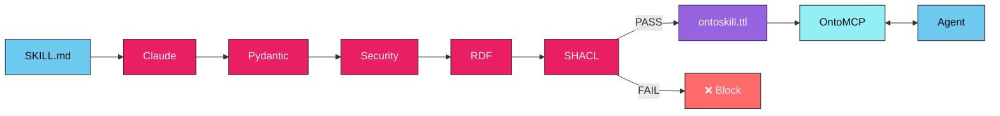
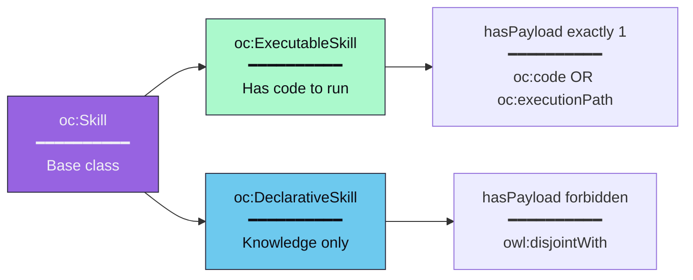
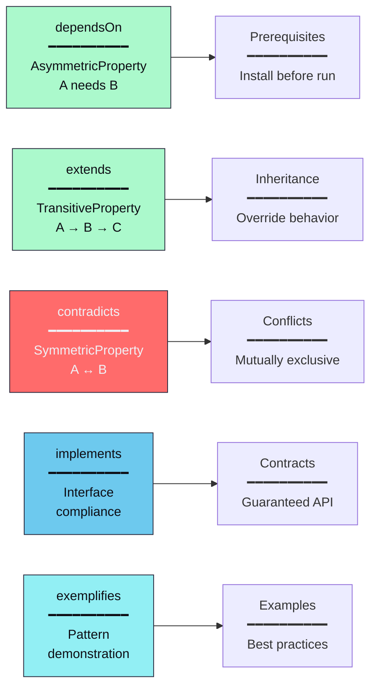
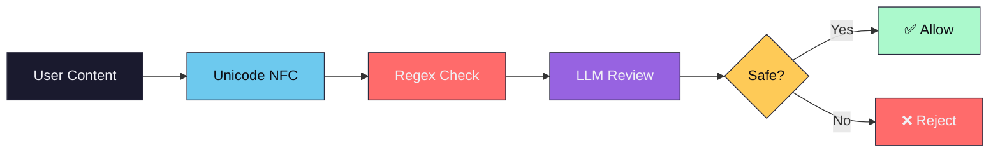

## The Compilation Pipeline



### Stage Details

| Stage | Input | Output | Description |
|-------|-------|--------|-------------|
| **Extract** | SKILL.md | ExtractedSkill | LLM extracts structured knowledge |
| **Security** | ExtractedSkill | ExtractedSkill | Regex + LLM review for threats |
| **Serialize** | ExtractedSkill | RDF Graph | Pydantic → RDF triples |
| **Validate** | RDF Graph | ValidationResult | SHACL shapes check validity |
| **Write** | RDF Graph | .ttl file | Atomic write with backup |

---

## Skill Types



The classification is **automatic** — you don't specify it. If a skill has code to execute, it's executable. If it's knowledge-only, it's declarative. These classes are **mutually exclusive** (`owl:disjointWith`).

---

## OWL 2 Properties



| Property | Type | Semantics |
|----------|------|-----------|
| `dependsOn` | Asymmetric | A needs B, but B doesn't need A |
| `extends` | Transitive | If A extends B and B extends C, then A extends C |
| `contradicts` | Symmetric | If A contradicts B, then B contradicts A |
| `implements` | Irreflexive | A cannot implement itself |
| `exemplifies` | Irreflexive | A cannot exemplify itself |

---

## The Validation Gatekeeper

Every skill must pass SHACL validation before being written. The constitutional shapes enforce:

| Constraint | Rule | Error |
|------------|------|-------|
| `resolvesIntent` | Required (min 1) | Skill must resolve at least one intent |
| `generatedBy` | Required (exactly 1) | Skill must have attestation |
| `requiresState` | Must be IRI | Must be a valid state URI |
| `yieldsState` | Must be IRI | Must be a valid state URI |
| `handlesFailure` | Must be IRI | Must be a valid state URI |

---

## Security Pipeline



**Detected threats:**
- Prompt injection (`ignore instructions`, `system:`, `you are now`)
- Command injection (`; rm`, `| bash`, command substitution)
- Data exfiltration (`curl -d`, `wget --data`)
- Path traversal (`../`, `/etc/passwd`)
- Credential exposure (`api_key=`, `password=`)

---

## Project Structure

```
ontoskills/
├── core/                       # OntoCore — Python skill compiler
│   ├── src/
│   │   ├── cli/                # Click CLI commands
│   │   │   ├── compile.py      # Compilation command
│   │   │   ├── query.py        # SPARQL query command
│   │   │   └── ...
│   │   ├── config.py           # Configuration constants
│   │   ├── core_ontology.py    # Namespace and TBox ontology creation
│   │   ├── differ.py           # Semantic drift detector
│   │   ├── drift_report.py     # Drift report generator
│   │   ├── embeddings/         # Vector embeddings export
│   │   ├── env.py              # Environment loading
│   │   ├── exceptions.py       # Exception hierarchy with exit codes
│   │   ├── explainer.py        # Skill explanation generator
│   │   ├── extractor.py        # ID and hash generation
│   │   ├── graph_export.py     # Graph format export
│   │   ├── linter.py           # Static ontology linter
│   │   ├── prompts.py          # LLM prompt templates
│   │   ├── registry/           # Store/package management
│   │   ├── schemas.py          # Pydantic models
│   │   ├── security.py         # Defense-in-depth security
│   │   ├── serialization.py    # RDF serialization with SHACL gatekeeper
│   │   ├── snapshot.py         # Ontology snapshots
│   │   ├── sparql.py           # SPARQL query engine
│   │   ├── storage.py          # File I/O, merging, orphan cleanup
│   │   ├── transformer.py      # LLM tool-use extraction
│   │   └── validator.py        # SHACL validation gatekeeper
│   └── tests/                  # Test suite
├── mcp/                        # OntoMCP — Rust MCP server
│   ├── Cargo.toml              # Rust package manifest
│   └── src/
│       ├── main.rs             # MCP stdio server
│       └── ...
├── skills/                     # Input: SKILL.md definitions
├── ontoskills/                 # Output: compiled .ttl files
│   ├── ontoskills-core.ttl     # Core ontology with states
│   └── */ontoskill.ttl         # Individual skill modules
├── registry/                   # OntoStore blueprint
└── specs/
    └── ontoskills.shacl.ttl    # SHACL shapes constitution
```

**Any source skill directory works** — add a `SKILL.md` file and OntoCore will compile it to a validated ontology module.

## Runtime Model

OntoMCP reads compiled ontology packages from `ontoskills/`. It does not read raw `SKILL.md` sources directly.

The user-facing `ontoskills` CLI is responsible for:

- installing `ontomcp`
- installing `ontocore`
- importing raw source repositories into `skills/vendor/`
- installing compiled packages from OntoStore or third-party stores
- enabling and disabling skills before they reach the MCP runtime

## Store Model

OntoStore is published as a static GitHub repository and is built in by default.

- Official packages are available immediately after install
- Third-party stores are added explicitly with `store add-source`
- Raw source repositories are compiled locally before being installed into `ontoskills/vendor/`
