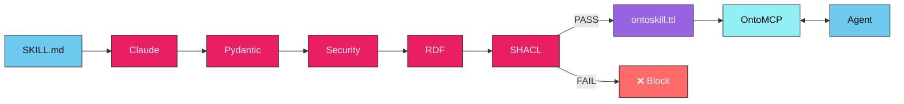
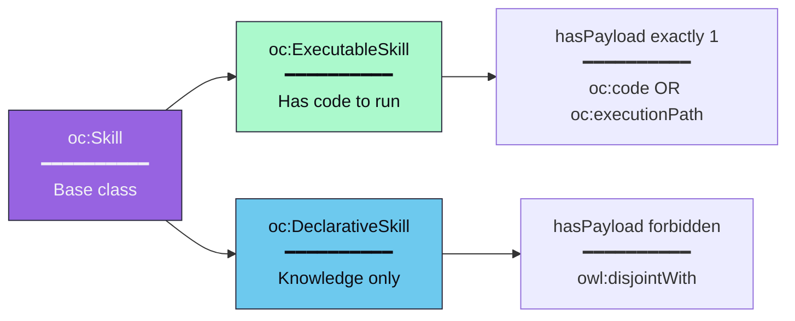
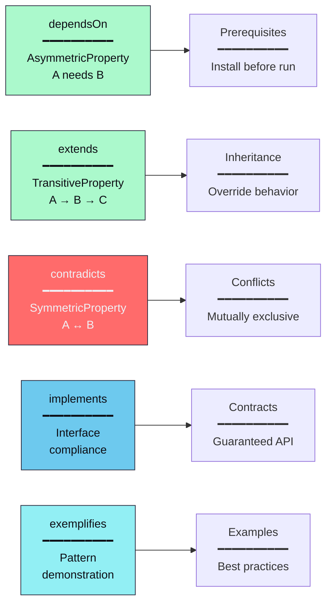
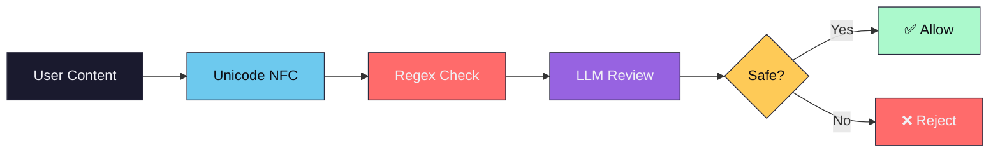

## 编译流水线



### 阶段详情

| 阶段 | 输入 | 输出 | 描述 |
|------|------|------|------|
| **提取** | SKILL.md | ExtractedSkill | LLM 提取结构化知识 |
| **安全** | ExtractedSkill | ExtractedSkill | 正则表达式 + LLM 审查威胁 |
| **序列化** | ExtractedSkill | RDF Graph | Pydantic → RDF 三元组 |
| **验证** | RDF Graph | ValidationResult | SHACL 形状检查有效性 |
| **写入** | RDF Graph | .ttl 文件 | 带备份的原子写入 |

---

## 技能类型



分类是**自动的** — 你不需要指定它。如果技能有要执行的代码，它就是可执行的。如果它只是知识，它就是声明式的。这些类是**互斥的**（`owl:disjointWith`）。

---

## OWL 2 属性



| 属性 | 类型 | 语义 |
|------|------|------|
| `dependsOn` | 非对称 | A 需要 B，但 B 不需要 A |
| `extends` | 传递 | 如果 A 扩展 B 且 B 扩展 C，则 A 扩展 C |
| `contradicts` | 对称 | 如果 A 与 B 矛盾，则 B 与 A 矛盾 |
| `implements` | 非自反 | A 不能实现自己 |
| `exemplifies` | 非自反 | A 不能示例自己 |

---

## 验证守门员

每个技能在写入前必须通过 SHACL 验证。宪法形状强制执行：

| 约束 | 规则 | 错误 |
|------|------|------|
| `resolvesIntent` | 必需（至少 1 个）| 技能必须解决至少一个意图 |
| `generatedBy` | 必需（恰好 1 个）| 技能必须有证明 |
| `requiresState` | 必须是 IRI | 必须是有效的状态 URI |
| `yieldsState` | 必须是 IRI | 必须是有效的状态 URI |
| `handlesFailure` | 必须是 IRI | 必须是有效的状态 URI |

---

## 安全管道



**检测到的威胁：**
- 提示注入（`ignore instructions`、`system:`、`you are now`）
- 命令注入（`; rm`、`| bash`、命令替换）
- 数据泄露（`curl -d`、`wget --data`）
- 路径遍历（`../`、`/etc/passwd`）
- 凭据暴露（`api_key=`、`password=`）

---

## 项目结构

```
ontoskills/
├── core/                       # OntoCore — Python 技能编译器
│   ├── src/
│   │   ├── cli/                # Click CLI 命令
│   │   │   ├── compile.py      # 编译命令
│   │   │   ├── query.py        # SPARQL 查询命令
│   │   │   └── ...
│   │   ├── config.py           # 配置常量
│   │   ├── core_ontology.py    # 命名空间和 TBox 本体创建
│   │   ├── differ.py           # 语义漂移检测器
│   │   ├── drift_report.py     # 漂移报告生成器
│   │   ├── embeddings/         # 向量嵌入导出
│   │   ├── env.py              # 环境加载
│   │   ├── exceptions.py       # 带退出码的异常层次结构
│   │   ├── explainer.py        # 技能解释生成器
│   │   ├── extractor.py        # ID 和哈希生成
│   │   ├── graph_export.py     # 图格式导出
│   │   ├── linter.py           # 静态本体检查器
│   │   ├── prompts.py          # LLM 提示模板
│   │   ├── registry/           # 商店/包管理
│   │   ├── schemas.py          # Pydantic 模型
│   │   ├── security.py         # 深度防御安全
│   │   ├── serialization.py    # 带 SHACL 守门员的 RDF 序列化
│   │   ├── snapshot.py         # 本体快照
│   │   ├── sparql.py           # SPARQL 查询引擎
│   │   ├── storage.py          # 文件 I/O、合并、孤立清理
│   │   ├── transformer.py      # LLM 工具使用提取
│   │   └── validator.py        # SHACL 验证守门员
│   └── tests/                  # 测试套件
├── mcp/                        # OntoMCP — Rust MCP 服务器
│   ├── Cargo.toml              # Rust 包清单
│   └── src/
│       ├── main.rs             # MCP stdio 服务器
│       └── ...
├── skills/                     # 输入：SKILL.md 定义
├── ontoskills/                 # 输出：已编译的 .ttl 文件
│   ├── ontoskills-core.ttl     # 带状态的核心本体
│   └── */ontoskill.ttl         # 单个技能模块
├── registry/                   # OntoStore 蓝图
└── specs/
    └── ontoskills.shacl.ttl    # SHACL 形状宪法
```

**任何源技能目录都可以** — 添加一个 `SKILL.md` 文件，OntoCore 就会将其编译为已验证的本体模块。

## 运行时模型

OntoMCP 从 `ontoskills/` 读取已编译的本体包。它不直接读取原始 `SKILL.md` 源文件。

面向用户的 `ontoskills` CLI 负责：

- 安装 `ontomcp`
- 安装 `ontocore`
- 将原始源仓库导入到 `skills/vendor/`
- 从 OntoStore 或第三方商店安装已编译的包
- 在技能到达 MCP 运行时之前启用和禁用技能

## 商店模型

OntoStore 作为静态 GitHub 仓库发布，默认内置。

- 官方包在安装后立即可用
- 第三方商店通过 `store add-source` 显式添加
- 原始源仓库在安装到 `ontoskills/vendor/` 之前在本地编译
