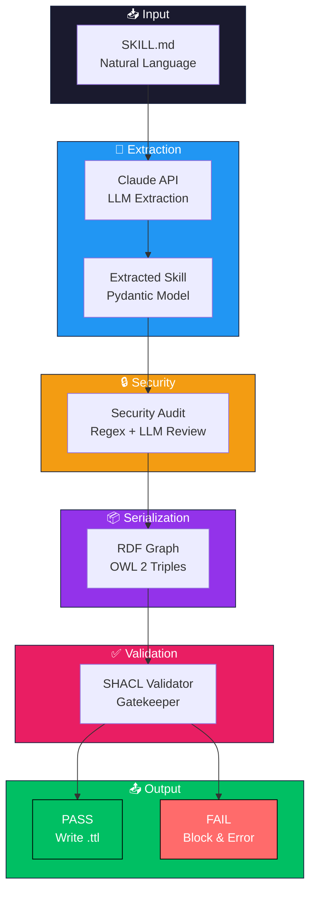

# What is OntoClaw?

OntoClaw is a **skill compiler** that transforms natural language skill definitions into **validated semantic knowledge graphs**. It bridges the gap between human-readable documentation and machine-executable ontologies.

## Why OntoClaw?

### The Determinism Problem

LLMs are inherently **non-deterministic** — the same query can yield different results, and reasoning about skill relationships requires reading entire documents. This creates:

- **Context rot** from lengthy skill files
- **Hallucinations** when information is scattered
- **No verifiable structure** for skill relationships

OntoClaw transforms this into **deterministic, queryable knowledge graphs**.

### Description Logics Foundation

Built on **OWL 2** (𝒜𝒞ℛ𝒪ℐ𝒟 Description Logic), enabling:

- **Decidable reasoning** — transitive, symmetric, inverse properties
- **Formal semantics** — no ambiguity in skill relationships
- **SPARQL queries** with O(1) indexed lookup vs O(n) text scanning

## How It Works

## Key Capabilities

| Capability | Description |
|------------|-------------|
| **LLM Extraction** | Uses Claude to extract structured knowledge from SKILL.md files |
| **Knowledge Architecture** | Follows the "A is a B that C" definition pattern (genus + differentia) |
| **OWL 2 Serialization** | Outputs valid OWL 2 ontologies in RDF/Turtle format |
| **SHACL Validation** | Constitutional gatekeeper ensures logical validity before write |
| **State Machines** | Skills can define preconditions, postconditions, and failure handlers |
| **Security Pipeline** | Defense-in-depth: regex patterns + LLM review for malicious content |

## Components

| Component | Language | Status | Description |
|-----------|----------|--------|-------------|
| **compiler/** | Python | ✅ Ready | Skill compiler to OWL 2 ontology |
| **mcp/** | Rust | 🚧 Planned | Fast MCP server for ontology queries |
| **skills/** | Markdown | ✅ Ready | Input skill definitions |
| **ontoskills/** | Turtle | Generated | Compiled ontology output |
| **specs/** | Turtle | ✅ Ready | SHACL shapes constitution |

## Get Started

[Get Started](/getting-started/) with OntoClaw in minutes.

## Links

- [GitHub Repository](https://github.com/mareasoftware/ontoclaw)
- [Roadmap](/roadmap/)
